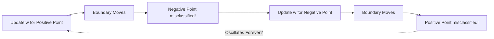
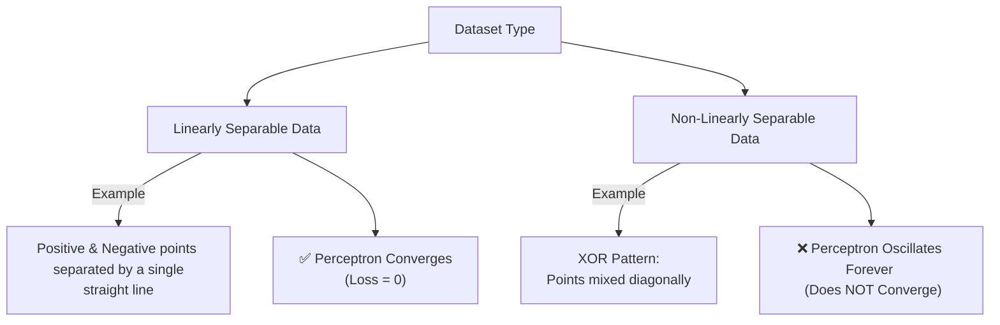
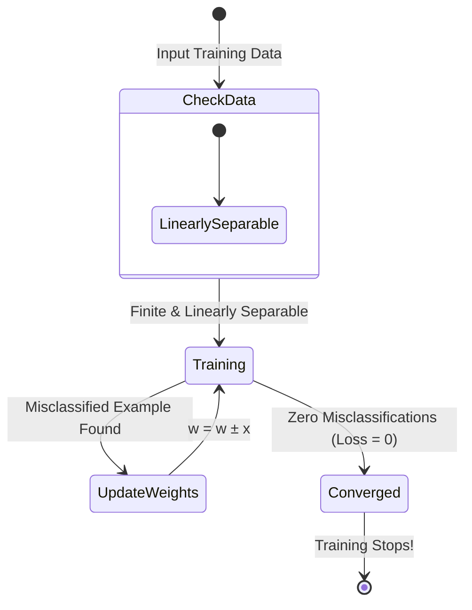

# Perceptron Learning Algorithm – Convergence

## 1. Recap

The Perceptron Learning Algorithm updates the weights only when it makes a mistake. There are only two update rules:

* **Misclassified Positive Point:**

$$\boxed{\mathbf{w} = \mathbf{w} + \mathbf{x}}$$


* **Misclassified Negative Point:**

$$\boxed{\mathbf{w} = \mathbf{w} - \mathbf{x}}$$


If the prediction is correct, **no update is made**.

---

## 2. The Main Question

The lecture asks an important question:

> **If we keep updating the weights for one point, won't we spoil the classification of another point?**



Will the Perceptron ever stop updating, or will it keep oscillating forever? This property is called **Convergence**.

---

## 3. What is Convergence?

A learning algorithm converges if, after a finite number of updates, it reaches a point where:

* All training examples are classified correctly.
* No further weight updates are needed.
* Training stops ($\boxed{\text{Loss} = 0}$).

---

## 4. Linearly Separable vs Non-Linearly Separable Data



### Visual Representation of Data Types

#### Linearly Separable Data

```
   +     +   
  -----------  <-- Single Decision Boundary (Line)
   -     -   

```

*(A single line successfully separates all positives from all negatives)*

#### Non-Linearly Separable Data (XOR Problem)

```
   +     -   
   -     +   

```

*(No single straight line can separate all positives from negatives without misclassifying at least one point)*

---

## 5. Formal Definition of Linearly Separable Data

Suppose:

* $P$ = set of all positive points
* $N$ = set of all negative points

The data is linearly separable if there exist weights $w_0, w_1, \dots, w_n$ such that:

$$\text{For every positive point: } \sum_{i=1}^{n}w_i x_i > w_0$$

$$\text{For every negative point: } \sum_{i=1}^{n}w_i x_i < w_0$$

---

## 6. Perceptron Convergence Theorem



> **Perceptron Convergence Theorem:**
> If the training dataset is **finite** and **linearly separable**, then the Perceptron Learning Algorithm is guaranteed to converge in a **finite number of steps**.

---

## 7. Summary Table

| Dataset Type | Can One Line Separate? | Perceptron Converges? | Behavior |
| --- | --- | --- | --- |
| **Linearly Separable** | ✅ Yes | ✅ Yes | Stops after finite steps $(\text{Loss} = 0)$ |
| **Non-Linearly Separable** | ❌ No | ❌ No | Weights oscillate indefinitely |

---

## Key Takeaways

1. **Update Condition:** Perceptron updates weights **only** on mistakes.
2. **Linearly Separable Data:** Guaranteed to converge in finite steps.
3. **Non-Linearly Separable Data:** Perceptron will never stop and will loop forever unless a maximum epoch/iteration limit is set.