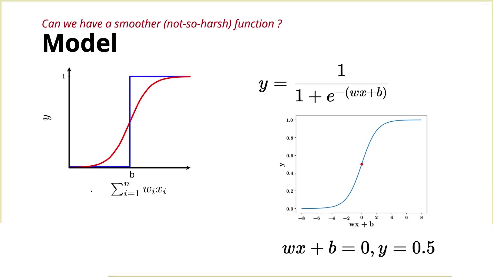
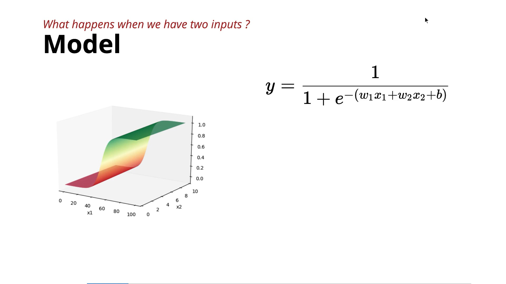
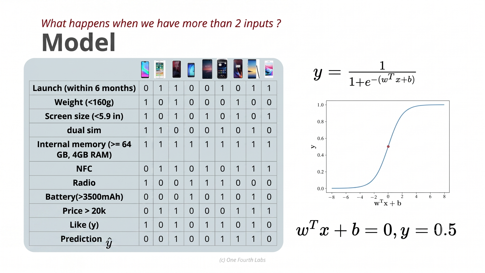

# **Sigmoid Function**

This lecture introduces the **Sigmoid (Logistic) Function**, explaining why it replaces the Perceptron's step function and how it works for one, two, and multiple input features. 

---

## 1. Why Replace the Perceptron?

The Perceptron uses a **step function**:

* Output = **0** or **1**
* Abrupt (harsh) decision boundary
* Doesn't model uncertainty

The goal is to replace it with a **smooth function** that changes gradually, similar to how humans make decisions. 

---

## 2. The Sigmoid (Logistic) Function

The chosen function is the **Logistic Function**, which belongs to the **Sigmoid family** of functions.

Its equation is:

$$\boxed{\sigma(z) = \frac{1}{1 + e^{-z}}}$$

where the input is the linear combination:

$$z = wx + b$$

So,

$$\boxed{\hat{y} = \frac{1}{1 + e^{-(wx+b)}}}$$

### Properties

* Smooth and continuous
* S-shaped (Sigmoid curve)
* Output is always between **0 and 1**
* Can be interpreted as a **probability** 

---

## 3. Understanding the Sigmoid Curve

The instructor demonstrates how to understand the graph by substituting values into the equation.

| (wx+b) | Output   |
| ------ | -------- |
| -2     | ≈ 0.12   |
| 0      | 0.50     |
| 2      | ≈ 0.88   |
| 8      | ≈ 0.9997 |

From these values, the graph becomes an **S-shaped curve**:

* Large negative input → output close to **0**
* Input = 0 → output = **0.5**
* Large positive input → output close to **1** 

---

## 4. Sigmoid with Two Inputs

For two input features:

$$\boxed{\hat{y} = \frac{1}{1 + e^{-(w_1x_1 + w_2x_2 + b)}}}$$

The output forms a **smooth 3D surface** instead of a sharp step.

The lecturer explains a **top-view visualization** using colors:

* 🔴 Dark red → output close to **0**
* 🟠 Orange → output around **0.5**
* 🟢 Dark green → output close to **1**

Changing the weights ($w_1, w_2$) and bias ($b$) shifts this smooth transition across the input space.

---

## 5. Sigmoid with Multiple Inputs

For (n) input features:

$$\boxed{\hat{y} = \frac{1}{1 + e^{-(w_1x_1 + w_2x_2 + \cdots + w_nx_n + b)}}}$$

Using vector notation:

$$\boxed{\hat{y} = \frac{1}{1 + e^{-(\mathbf{w}^T\mathbf{x} + b)}}}$$

where:

* (w) = weight vector
* (x) = input vector
* (w^Tx) = **dot product**

No matter how many inputs there are:

* Compute **one scalar value** (w^Tx+b).
* Pass it through the sigmoid function.
* Obtain **one output between 0 and 1**. 

---

# Key Formulas to Remember

### Single Input

$$\boxed{\hat{y} = \frac{1}{1 + e^{-(wx + b)}}}$$

### Two Inputs

$$\boxed{\hat{y} = \frac{1}{1 + e^{-(w_1x_1 + w_2x_2 + b)}}}$$

### Multiple Inputs

$$\boxed{\hat{y} = \frac{1}{1 + e^{-(\mathbf{w}^T\mathbf{x} + b)}}}$$

---

# Key Takeaways

* The **Sigmoid function** replaces the Perceptron's harsh step function with a **smooth S-shaped curve**.
* Its output always lies between **0 and 1**, making it useful for representing probabilities.
* The same sigmoid equation works for **one, two, or many input features** by computing the weighted sum ($\mathbf{w}^T\mathbf{x} + b$).
* In higher dimensions, the output remains a **single scalar value**, regardless of how many input features are used.