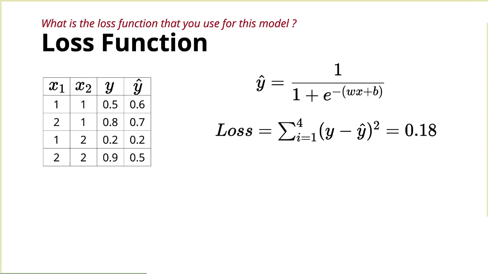
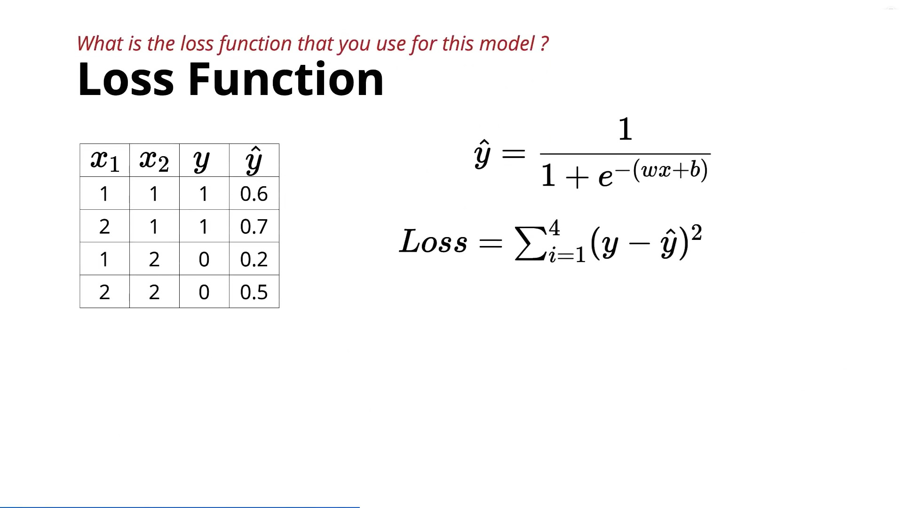

# **Loss Function for the Sigmoid Neuron**

In this lecture, the instructor introduces the **Loss Jar** for the Sigmoid Neuron. The focus is on how to measure the error between the predicted output and the true output using the **Squared Error Loss**.

---

## 1. Quick Recap

So far, we have covered three jars:

### Data

* Input features: $x_1, x_2, \ldots, x_n$
* Target output: A value between $0$ and $1$ (usually interpreted as a probability)

**Example:**

| Input | True Output |
| :--- | :--- |
| Person A | $0.8$ |
| Person B | $0.3$ |
| Person C | $0.9$ |

### Task

The sigmoid neuron is mainly used for:

* **Regression** (predicting probabilities)
* Can also be used for **binary classification** by applying a threshold (e.g., $0.5$).

### Model

The relationship between input and output is modeled using the logistic (sigmoid) function:

$$\boxed{\hat{y} = \frac{1}{1 + e^{-(\mathbf{w}^T\mathbf{x} + b)}}}$$

where:

* $\mathbf{w}$ = weights
* $b$ = bias
* $\hat{y}$ = predicted output

---

## 2. Loss Function

To evaluate how good the model is, we compare:

* True output ($y$)
* Predicted output ($\hat{y}$)

The lecture uses the **Squared Error Loss**:

$$\boxed{\text{Loss} = \sum (y - \hat{y})^2}$$

For every training example:

1. Compute the prediction.
2. Subtract it from the true value.
3. Square the error.
4. Add the errors for all examples.

A smaller loss means the model is making better predictions.

---

## 3. Example with Probability Targets

Suppose:

| True Output ($y$) | Predicted Output ($\hat{y}$) |
| :--- | :--- |
| 0.6 | 0.5 |
| 0.7 | 0.8 |
| 0.2 | 0.2 |
| 0.5 | 0.9 |

Loss:

$$(0.6 - 0.5)^2 + (0.7 - 0.8)^2 + (0.2 - 0.2)^2 + (0.5 - 0.9)^2$$

Adding all squared errors gives the total loss.

---

## 4. What if the Labels are Only 0 and 1?

Even if the dataset contains only binary labels:

| True Label ($y$) | Predicted Output ($\hat{y}$) |
| :--- | :--- |
| 1 | 0.6 |
| 1 | 0.7 |
| 0 | 0.2 |
| 0 | 0.5 |

We can still use the same loss:

$$(1 - 0.6)^2 + (1 - 0.7)^2 + (0 - 0.2)^2 + (0 - 0.5)^2$$

So the sigmoid neuron works even when the labels are just $0$ and $1$.

---

## 5. Why is Squared Error Better than the Perceptron Loss?

The perceptron used **0–1 loss**:

* Correct prediction $\rightarrow \text{Loss} = 0$
* Wrong prediction $\rightarrow \text{Loss} = 1$

Every incorrect prediction had the same penalty, regardless of how close it was to the correct answer.

### Example 1 (True label = 1)

| Prediction ($\hat{y}$) | Error ($y - \hat{y}$) | Squared Error $(y - \hat{y})^2$ |
| :--- | :--- | :--- |
| 0.6 | 0.4 | 0.16 |
| 0.7 | 0.3 | 0.09 |

The prediction $0.6$ is worse than $0.7$, so it contributes more to the total loss.

### Example 2 (True label = 0)

| Prediction ($\hat{y}$) | Error ($y - \hat{y}$) | Squared Error $(y - \hat{y})^2$ |
| :--- | :--- | :--- |
| 0.2 | 0.2 | 0.04 |
| 0.5 | 0.5 | 0.25 |

Here, $0.5$ is much farther from the correct answer than $0.2$, so it receives a much larger penalty.

This makes the loss **fine-grained**, unlike the perceptron's all-or-nothing loss.

---

## 6. Why is This Important During Training?

The learning algorithm uses the loss to decide how much to adjust the model parameters.

* Predictions with **larger errors** require **larger updates**.
* Predictions with **smaller errors** require **smaller updates**.

Thus, the model focuses more on correcting its biggest mistakes.

---

## 7. Cross-Entropy Loss

The instructor briefly mentions another important loss function:

* **Cross-Entropy Loss**

It is widely used with sigmoid neurons and logistic regression and will be covered later.

For now, **Squared Error Loss** is sufficient because it is familiar and easy to understand.

---

## Summary Table

| Component | Description |
| :--- | :--- |
| **Data** | Inputs with outputs between $0$ and $1$ (or binary labels) |
| **Task** | Regression (probabilities) or binary classification |
| **Model** | Sigmoid function |
| **Loss Function** | Squared Error Loss: $\sum (y - \hat{y})^2$ |

---

## Key Takeaways

* The **Squared Error Loss** measures the difference between the true output and the sigmoid's prediction.
* It works for both **continuous probability targets** and **binary labels** ($0$ or $1$).
* Unlike the perceptron's 0–1 loss, squared error is **fine-grained**, giving larger penalties to predictions that are farther from the correct value.
* This detailed error information helps the learning algorithm make **smarter parameter updates**, leading to better model training.
* **Cross-Entropy Loss** is another commonly used loss function with sigmoid neurons and will be introduced later.