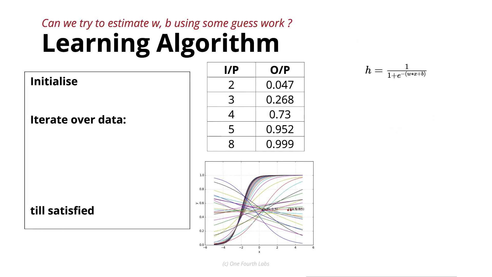

# **Learning Algorithm for the Sigmoid Neuron**

In this lecture, the instructor introduces the **Learning Algorithm Jar** and explains what the learning algorithm is trying to achieve. The actual algorithm isn't discussed yet; instead, the focus is on the goal of learning.

---

## 1. Quick Recap of Previous Jars

Before discussing the learning algorithm, the instructor reviews the first four jars.

### Data

* **Input features:** $x_1, x_2, \ldots, x_n$
* **Output:**
  * Either continuous values between $0$ and $1$ (regression), or
  * Binary labels ($0$ or $1$) (classification).

### Task

The sigmoid neuron supports:

* **Regression:** Predicting probabilities or scores between $0$ and $1$.
* **Binary Classification:** Predicting class $0$ or $1$ (often by applying a threshold such as $0.5$).

### Loss Function

The loss used is the **Squared Error Loss**:

$$\boxed{\text{Loss} = \sum (y - \hat{y})^2}$$

This measures how far the predicted outputs are from the true outputs.

### Model

The chosen model is the sigmoid function:

$$\boxed{\hat{y} = \frac{1}{1 + e^{-(wx + b)}}}$$

or, for multiple inputs,

$$\boxed{\hat{y} = \frac{1}{1 + e^{-(\mathbf{w}^T\mathbf{x} + b)}}}$$

The parameters to learn are:

* **Weights** ($\mathbf{w}$)
* **Bias** ($b$)

---

## 2. Sigmoid is a Family of Functions

A sigmoid is not just one curve. Different values of $w$ and $b$ produce different sigmoid curves.

Changing these parameters affects:

* **Weight ($w$):**
  * Changes the slope.
  * Positive $w \rightarrow$ Increasing curve.
  * Negative $w \rightarrow$ Decreasing curve.
* **Bias ($b$):**
  * Shifts the curve left or right.
  * Changes the point where the output equals $0.5$.

Thus, there are infinitely many possible sigmoid functions.

---

## 3. Goal of Learning



The main objective is:

> **Find the values of $w$ and $b$ so that the sigmoid function closely matches the training data.**

For every training input:

1. Feed the input into the sigmoid.
2. The predicted output should be as close as possible to the true output.

**Example:**

| Input ($x$) | True Output ($y$) |
| :--- | :--- |
| 2 | 0.047 |
| 3 | 0.268 |
| 4 | 0.735 |
| 5 | 0.950 |

The ideal sigmoid curve should pass as close as possible to these points.

When this happens:

* Predictions become accurate.
* The total loss becomes very small.

---

## 4. How Learning Starts

Initially, we do not know the correct values of $w$ and $b$.

So we begin with **random values**. This gives us an initial sigmoid curve, which is usually not a good fit for the data.

---

## 5. Generic Training Procedure

The instructor revisits the standard machine learning training recipe:

1. **Step 1:** Initialize random $w$ and random $b$.
2. **Step 2:** For each training example:
   * Input $x$.
   * Compute prediction:

$$\hat{y} = \frac{1}{1 + e^{-(wx + b)}}$$

   * Compare prediction with the true output ($y$).
   * Compute the loss.
3. **Step 3:** Update $w$ and $b$ so that the prediction becomes closer to the true value.
4. **Step 4:** Repeat this process for all training examples.
5. **Step 5:** Run through the dataset multiple times (epochs) until the loss becomes small.

---

## 6. What Is Still Missing?

At this point, one important question remains unanswered:

> **How exactly should we update $w$ and $b$?**

The lecture does not explain the mathematical update rule yet. Instead, it only establishes that:

* We compute predictions.
* Measure the error.
* Use that error to improve $w$ and $b$.

The precise method for updating these parameters will be introduced in the next lectures.

---

## Complete Learning Pipeline

```text
Training Data
      │
      ▼
Random w, b
      │
      ▼
Sigmoid Function
      │
      ▼
Predicted Output (ŷ)
      │
      ▼
Compare with True Output (y)
      │
      ▼
Compute Squared Error Loss
      │
      ▼
Update w and b
      │
      ▼
Repeat Until Loss is Small
```
## Key Takeaways

* The learning algorithm's goal is to find the best values of weights ($w$) and bias ($b$) so that the sigmoid function fits the training data.
* Training starts with random parameter values and repeatedly improves them by comparing predictions with the true outputs.
* The process follows the standard machine learning workflow: **initialize** $\rightarrow$ **predict** $\rightarrow$ **compute loss** $\rightarrow$ **update parameters** $\rightarrow$ **repeat**.
* Although the update mechanism is not yet covered, the objective is clear: **minimize the loss** so that the sigmoid curve closely matches the underlying relationship between inputs and outputs.