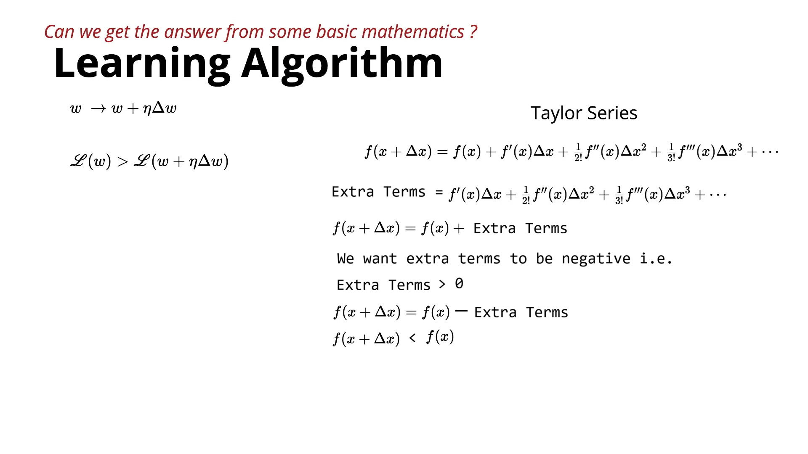

# **Introduction to Taylor Series for Learning Algorithms**

This lecture introduces the **Taylor Series**, a mathematical tool that will later be used to derive a principled algorithm (**Gradient Descent**) for updating model parameters.

---

## 1. Goal Reminder

The objective is still the same: find an update $\Delta w$ such that after updating the weight,

$$w_{\text{new}} = w + \Delta w$$

the new loss is smaller than the current loss.

Mathematically:

$$\boxed{L(w + \Delta w) < L(w)}$$

If every update decreases the loss, the algorithm will eventually reach the minimum loss.

---

## 2. Why Taylor Series?

We know the loss at the current point, $L(w)$, but we want to know what the loss will become after taking a small step.

**Taylor Series** provides exactly this relationship by approximating the function value at a nearby point using the current function value and its derivatives.

---

## 3. Taylor Series Formula

For a function $f(x)$:

$$\boxed{f(x + \Delta x) = f(x) + f'(x)\Delta x + \frac{f''(x)}{2!}\Delta x^2 + \frac{f'''(x)}{3!}\Delta x^3 + \cdots}$$

where:

* $f(x)$ = current function value
* $\Delta x$ = small step
* $f'(x)$ = first derivative
* $f''(x)$ = second derivative
* $f'''(x)$ = third derivative

---

## 4. Connection to Learning

This formula compares:

* **Current Loss:** $f(x)$
* **New Loss:** $f(x + \Delta x)$

If the additional terms are negative, then:

$$f(x + \Delta x) < f(x)$$

which means **the loss decreases**. Therefore, the learning algorithm should choose $\Delta x$ so that the extra terms reduce the overall function value.

---

## 5. Understanding Derivatives

The instructor reviews derivatives using the example $f(x) = x^3$:

* **First derivative:** $f'(x) = 3x^2$
* **Second derivative:** $f''(x) = 6x$
* **Third derivative:** $f'''(x) = 6$
* **Fourth derivative:** $f''''(x) = 0$

After the fourth derivative, all higher derivatives are zero for this polynomial.

---

## 6. Example Using Taylor Series

Given:

$$f(x) = x^3$$

* **Current point:** $x = 3$
* **Current function value:** $f(3) = 27$

Suppose we want to estimate $f(3.0001)$ instead of calculating $(3.0001)^3$ directly:

Here, $\Delta x = 0.0001$.

Using Taylor Series:

$$f(3.0001) = 27 + 27(0.0001) + \frac{18}{2!}(0.0001)^2 + \frac{6}{3!}(0.0001)^3$$

where:

* $f(3) = 27$
* $f'(3) = 27$
* $f''(3) = 18$
* $f'''(3) = 6$

Since the fourth derivative is zero, the expansion stops here.

---

## 7. Main Intuition

Suppose the current function value is $27$. The Taylor Series expresses the new value as:

$$27 + \text{(extra terms)}$$

If we can choose $\Delta x$ such that the extra terms become negative, then:

$$f(x + \Delta x) < f(x)$$

meaning the function value decreases. This is exactly the idea needed for minimizing loss during training.

---

## 8. Why This Matters

The learning algorithm needs a systematic way to decide:

1. How much to move, and
2. In which direction to move,

so that every update reduces the loss. Taylor Series provides the mathematical bridge between the current point and a nearby point, setting the stage for deriving **Gradient Descent**.

---

## Summary Table

| Concept | Expression |
| :--- | :--- |
| **Weight Update Goal** | $L(w + \Delta w) < L(w)$ |
| **Taylor Expansion** | $f(x + \Delta x) = f(x) + f'(x)\Delta x + \frac{f''(x)}{2!}\Delta x^2 + \cdots$ |
| **Step Condition** | $\text{Extra Terms} < 0 \implies \text{Loss Decreases}$ |

---

## Key Takeaways

* The goal remains to find an update that always decreases the loss.
* Taylor Series approximates the function value after taking a small step:

$$f(x + \Delta x) = f(x) + f'(x)\Delta x + \frac{f''(x)}{2!}\Delta x^2 + \cdots$$

* If the additional Taylor Series terms are negative, the new function value becomes smaller than the current one.
* This idea forms the mathematical foundation for deriving the Gradient Descent update rule in upcoming lectures.