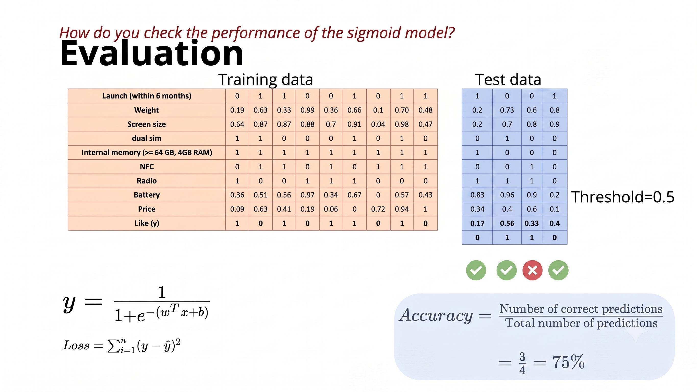

# **Evaluation of Logistic Regression**

This lecture explains how to evaluate the performance of a trained Logistic Regression model on unseen test data.

---

## 1. Recap of the Machine Learning Pipeline

So far, we have covered:

* **Data:** Input features ($x$) and labels ($y$)
* **Task:** Predict a probability between $0$ and $1$
* **Model:** Sigmoid (Logistic) Function
* **Loss Function:** Squared Error Loss (later Cross-Entropy Loss)
* **Learning Algorithm:** Gradient Descent

The final remaining step is **Evaluation**.

---

## 2. Evaluation on Test Data

After training, performance is measured using a separate **test dataset** that the model has never seen.

For every test example $i$:

* **True output:** $y_i$
* **Predicted output:** $\hat{y}_i$

We compare $y_i$ and $\hat{y}_i$ to quantify the model's predictive performance.

---

## 3. Metric 1: Root Mean Squared Error (RMSE)

Since Logistic Regression predicts continuous probabilities ($\hat{y} \in [0, 1]$), we can evaluate it as a regression problem using **RMSE**:

$$\boxed{\text{RMSE} = \sqrt{\frac{1}{N}\sum_{i=1}^{N}(y_i - \hat{y}_i)^2}}$$

### Step-by-Step Calculation:

1. **Compute Error:** $y_i - \hat{y}_i$
2. **Square the Error:** $(y_i - \hat{y}_i)^2$
3. **Compute the Mean (Average):** $\frac{1}{N}\sum (y_i - \hat{y}_i)^2$
4. **Take the Square Root:** $\sqrt{\text{Mean Squared Error}}$

This breakdown gives the name: **R**oot **M**ean **S**quared **E**rror.

---

## 4. Difference Between Loss and RMSE

* **Training Phase (Loss Function):** Minimizes Mean Squared Error (**MSE**):

$$\text{MSE} = \frac{1}{N}\sum(y_i - \hat{y}_i)^2$$

* **Evaluation Phase (Metric):** Usually reports Root Mean Squared Error (**RMSE**):

$$\text{RMSE} = \sqrt{\frac{1}{N}\sum(y_i - \hat{y}_i)^2}$$

> **Key Rule:** Training uses **MSE**, whereas evaluation reports **RMSE**.

---

## 5. Interpretation of RMSE

$$\boxed{\text{RMSE} = 0.311}$$

* **Lower RMSE** $\rightarrow$ Better predictions.
* **$\text{RMSE} = 0$** $\rightarrow$ Perfect predictions.

---

## 6. Converting Logistic Regression into Classification

When discrete class labels ($0$ or $1$) are required rather than raw probabilities, we apply a decision threshold (typically $0.5$):

$$\text{Predicted Class } = \begin{cases} 1 & \text{if } \hat{y} > 0.5 \\ 0 & \text{if } \hat{y} \le 0.5 \end{cases}$$

### Example Thresholding:

| Sigmoid Output ($\hat{y}$) | Predicted Class |
| :---: | :---: |
| $0.32$ | $0$ |
| $0.82$ | $1$ |
| $0.41$ | $0$ |
| $0.15$ | $0$ |

---

## 7. Metric 2: Classification Accuracy



After converting predicted probabilities into discrete class decisions ($0$ or $1$), we compute **Accuracy**:

$$\boxed{\text{Accuracy} = \frac{\text{Number of Correct Predictions}}{\text{Total Number of Predictions}}}$$

### Lecture Example:

* **Total Test Examples:** $4$
* **Correct Predictions:** $3$

$$\text{Accuracy} = \frac{3}{4} = 0.75 \quad (75\%)$$

---

## 8. Summary of Evaluation Approaches

1. **Regression Approach (Probabilities):** Evaluate continuous outputs directly using **RMSE**.
2. **Classification Approach (Discrete Labels):** Apply a threshold (e.g., $0.5$) to obtain $0/1$ outputs and calculate **Accuracy**.

---

## Workflow Diagram

```text
               Training Phase
                     │
                     ▼
           Initialize Parameters
                     │
                     ▼
           Compute Predictions (ŷ)
                     │
                     ▼
             Compute MSE Loss
                     │
                     ▼
             Compute Gradients
                     │
                     ▼
          Update w and b (GD)
                     │
                     ▼
             Repeat to Convergence
                     │
                     ▼
               Evaluation Phase (Test Data)
                     │
         ┌───────────┴───────────┐
         ▼                       ▼
Continuous Probabilities   Thresholding (ŷ > 0.5)
         │                       │
         ▼                       ▼
     Calc RMSE            Discrete Classes (0/1)
                                 │
                                 ▼
                           Calc Accuracy

```
---

### Key Takeaways

* Evaluate trained models on an unseen test dataset.
* Continuous probability evaluation uses **RMSE**:

$$\text{RMSE} = \sqrt{\frac{1}{N}\sum(y_i - \hat{y}_i)^2}$$

* For discrete classification, threshold outputs at $0.5$ and calculate **Accuracy**:

$$\text{Accuracy} = \frac{\text{Correct Predictions}}{\text{Total Predictions}}$$

---