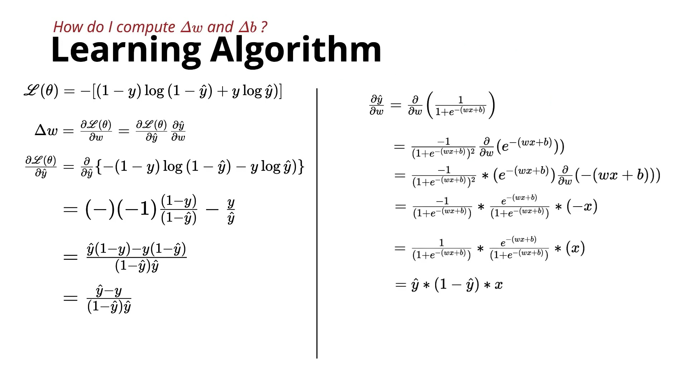
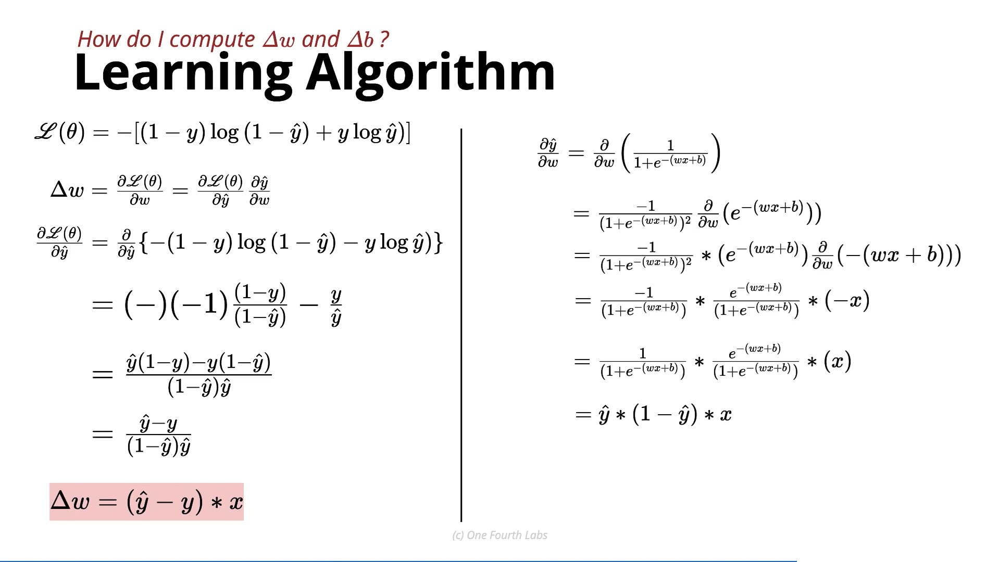

# Cross-Entropy Loss Derivative for Logistic Regression

This lecture derives the gradient/update rule for weight ($w$) and bias ($b$) when using binary cross-entropy loss with a sigmoid activation function.

---

### 1. Prediction Using Sigmoid

For a single training example:

$$\hat{y} = \sigma(wx + b) = \frac{1}{1 + e^{-(wx + b)}}$$

Where:
* $x$ = Input feature
* $w$ = Weight
* $b$ = Bias
* $y \in \{0, 1\}$ = Ground truth label
* $\hat{y} \in (0, 1)$ = Predicted probability

---

### 2. Binary Cross-Entropy Loss

For a single data point:

$$\mathcal{L} = -\left[ y \log(\hat{y}) + (1 - y) \log(1 - \hat{y}) \right]$$

*(For $N$ data points, the total loss is the sum or average of individual losses across all points.)*

---

### 3. Goal: Find $\frac{\partial \mathcal{L}}{\partial w}$

Using the **Chain Rule**:

$$\frac{\partial \mathcal{L}}{\partial w} = \frac{\partial \mathcal{L}}{\partial \hat{y}} \times \frac{\partial \hat{y}}{\partial w}$$

We evaluate these two partial derivatives separately:

#### Part 1: Derivative of Loss with Respect to Prediction ($\frac{\partial \mathcal{L}}{\partial \hat{y}}$)

$$\frac{\partial \mathcal{L}}{\partial \hat{y}} = -\left[ \frac{y}{\hat{y}} - \frac{1 - y}{1 - \hat{y}} \right] = -\left[ \frac{y(1 - \hat{y}) - (1 - y)\hat{y}}{\hat{y}(1 - \hat{y})} \right]$$

Simplifying the numerator:

$$\frac{\partial \mathcal{L}}{\partial \hat{y}} = \frac{\hat{y} - y}{\hat{y}(1 - \hat{y})}$$

#### Part 2: Derivative of Sigmoid Output with Respect to Weight ($\frac{\partial \hat{y}}{\partial w}$)

Since $\hat{y} = \sigma(z)$ where $z = wx + b$, the derivative of the sigmoid function is $\sigma'(z) = \hat{y}(1 - \hat{y})$:

$$\frac{\partial \hat{y}}{\partial w} = \hat{y}(1 - \hat{y}) \cdot x$$

---

### 4. Final Gradient Computation

Multiplying the two partial derivatives together:

$$\frac{\partial \mathcal{L}}{\partial w} = \left[ \frac{\hat{y} - y}{\hat{y}(1 - \hat{y})} \right] \times \left[ \hat{y}(1 - \hat{y}) \cdot x \right]$$

The $\hat{y}(1 - \hat{y})$ terms in the numerator and denominator **cancel out perfectly**:

$$\boxed{\frac{\partial \mathcal{L}}{\partial w} = (\hat{y} - y)x}$$

---

### 5. Gradient for Bias

Since the feature multiplier for bias is $1$ ($\frac{\partial z}{\partial b} = 1$):

$$\boxed{\frac{\partial \mathcal{L}}{\partial b} = \hat{y} - y}$$

---

### 6. Parameter Update Rules

Using Gradient Descent with learning rate $\alpha$:

$$w \leftarrow w - \alpha (\hat{y} - y) x$$

$$b \leftarrow b - \alpha (\hat{y} - y)$$

---

### Main Takeaway

The combination of a **Sigmoid Activation** and **Binary Cross-Entropy Loss** results in an elegant gradient simplification:

$$\boxed{\frac{\partial \mathcal{L}}{\partial w} = (\hat{y} - y)x} \qquad \text{and} \qquad \boxed{\frac{\partial \mathcal{L}}{\partial b} = \hat{y} - y}$$

> **Key Insight:** The gradient is simply the prediction error $(\hat{y} - y)$ scaled by the input feature $x$. This prevents the saturation/vanishing gradient issues that occur when using Squared Error Loss with Sigmoid outputs!