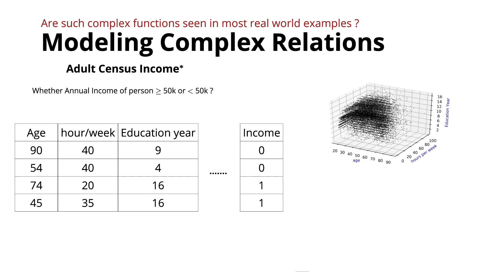
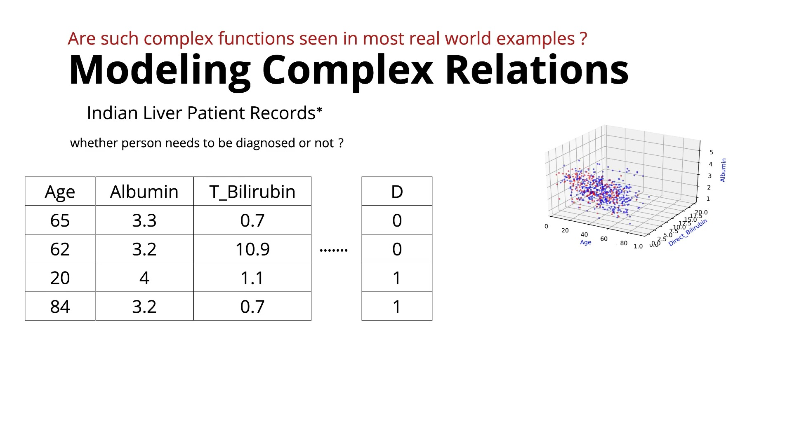
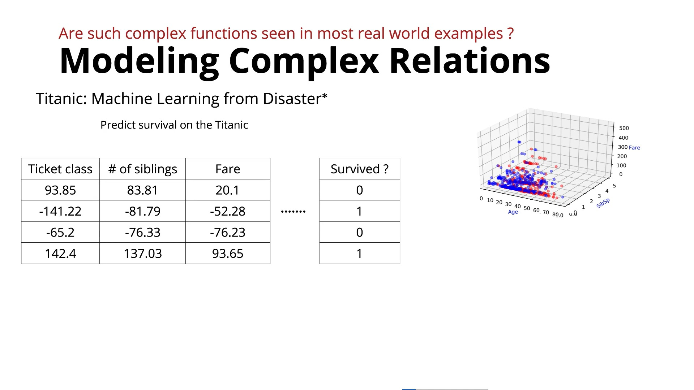

# Complex Functions in Real-World Data

This lecture continues the previous discussion about **why simple models such as perceptrons and sigmoid neurons are not enough**.

The lecture focuses on two big questions:

1. **Do complex functions actually occur in real-world problems?**
2. **If yes, how can we construct such complex functions?**

---

### 1. Real-World Data Is Often Non-Linearly Separable

The lecturer shows several real-world datasets to demonstrate that input-output relationships are often highly complex.

#### Example 1: Income Prediction

A census dataset contains features such as:
* Age
* Hours worked per week
* Years of education

**Goal:** Predict whether a person's income is **>50K** or **<50K**.

When data points are plotted by income class, the two classes are thoroughly mixed together. There is **no single straight line or hyperplane** that can separate them. In some regions, nearby points belong to completely different classes, so a single linear boundary or a single sigmoid function cannot model the data accurately.

---

### 2. Medical & Behavioral Examples

#### Indian Liver Patient Data

* **Features:** Age, albumin level, bilirubin level, and other medical measurements.
* **Goal:** Predict the presence of liver disease.
* **Surface Shape:** Positive and negative cases overlap in multiple clusters. The required decision surface must be **wavy and multi-peaked**—rising to $1$ in specific regions and dropping to $0$ nearby.

#### Titanic Survival Prediction

* **Features:** Ticket class, fare, passenger age, etc.
* **Goal:** Predict whether a passenger survived.
* **Surface Shape:** Classes are mixed non-linearly, making simple monotonic models inadequate.

---

### 3. What Kind of Function Do We Actually Need?

For simple non-linear datasets, we might only need a single bounded region:

However, for complex real-world datasets, the function may need multiple peaks and valleys:

Meaning:
* Output rises to $1$ in certain regions
* Drops to $0$ in intermediate zones
* Rises to $1$ again elsewhere depending on the input

In high-dimensional spaces with multiple features, this becomes an extremely intricate **multi-dimensional decision surface**.

---

### 4. The Main Problem

We know that training a model means finding an approximating function:

$$\hat{y} = \hat{f}(x)$$

#### The Core Challenge
For simple functions, we can explicitly write standard parametric forms:

$$\sin(x), \quad \cos(x), \quad \sigma(w^T x + b)$$

However, for a complicated real-world dataset with many features, we **cannot manually guess or hand-write** the exact mathematical form of $\hat{f}(x_1, x_2, x_3, \dots)$.

---

### The Core Idea

$$\text{Real-World Data} \longrightarrow \text{Complex Non-Linear Boundaries} \longrightarrow \text{Simple Models Fail} \longrightarrow \text{Requires Complex Functions} \longrightarrow \text{How Do We Construct Them?}$$

The next lecture answers this challenge by introducing a systematic recipe:

> **Starting with simple base functions (neurons) and combining/layering them to build arbitrarily complex functions.**

*This concept forms the exact foundation for **Feedforward Neural Networks**.*

---

### In One Sentence

> **Real-world datasets often have highly complex, non-linear relationships, requiring a systematic method to combine simple functions into complex, trainable decision surfaces.**