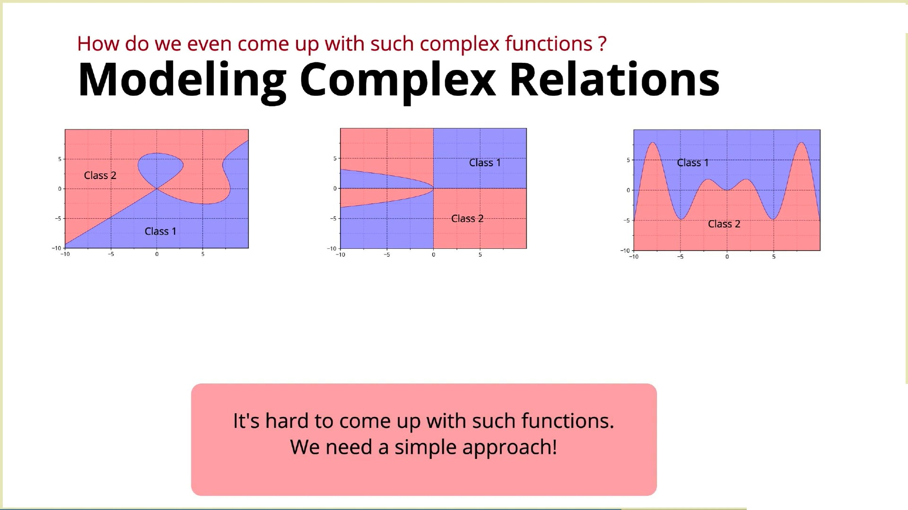
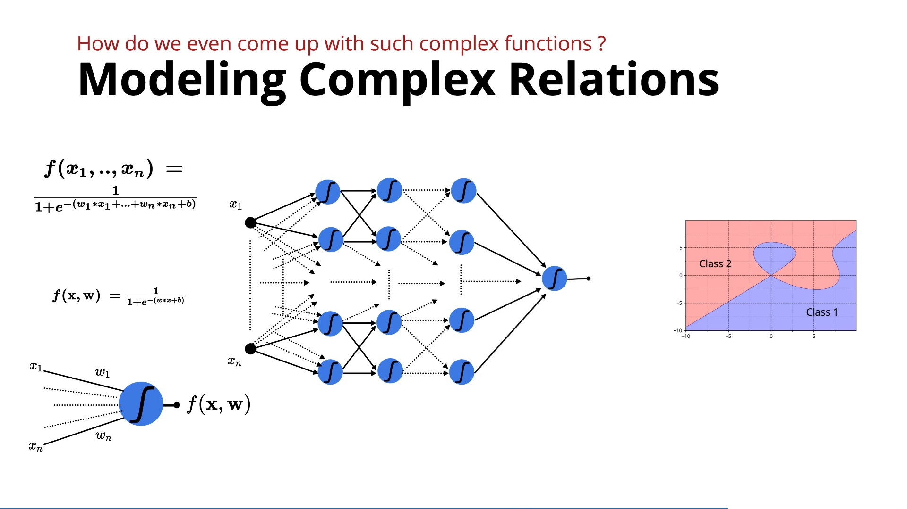
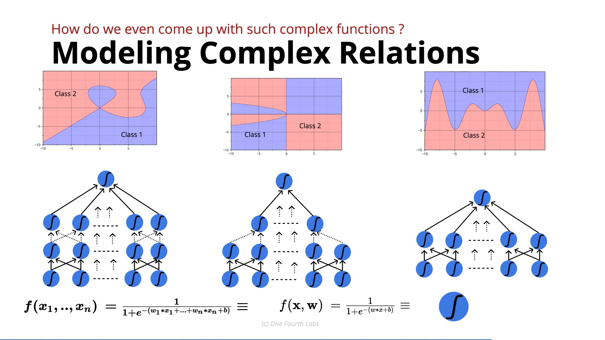

# How Can Simple Neurons Build Complex Functions?

This lecture answers the core question from previous topics: **If real-world data requires extremely complex functions, how do we actually construct them?**

The fundamental principle of Deep Neural Networks (DNNs) is:

$$\boxed{\text{Simple Base Function (Neuron)} \longrightarrow \text{Combine via Layers} \longrightarrow \text{Complex Function}}$$

---

### 1. The Core Problem: We Cannot Manually Invent Complex Functions

Suppose we need to model a non-linear relationship $\hat{y} = f(x)$. 

A complex mathematical function could theoretically look like:

$$\hat{y} = \left(\sin x + \cos x^3 + e^x + x^{10}\right) \frac{1}{\log x}$$

In practical machine learning, we cannot guess:
* Which mathematical operators to choose
* How complex the function should be
* What parameters to assign

Since the space of possible equations is infinite, hand-crafting the exact parametric function for real-world data is impossible.

---

### 2. The Brick & House Analogy 🧱

You don't construct a house as a single monolithic block. Instead:

$$\boxed{\text{Simple Bricks} \longrightarrow \text{Layered Rows} \longrightarrow \text{Complex House}}$$

A complex structure is built by repeatedly combining simple, standardized building blocks. Varying the arrangement of identical bricks produces completely different architectures.

---

### 3. What Is the "Brick" of a Neural Network?

For Deep Neural Networks, the fundamental building block is a **Sigmoid Neuron** (or other simple activation functions):

$$f(x_1, \dots, x_n) = \frac{1}{1 + e^{-(w_1 x_1 + \dots + w_n x_n + b)}}$$

While a single sigmoid neuron is simple, combining dozens or thousands of them creates a composite function of high mathematical complexity.

---

### 4. Combining Neurons Into Layers

The hierarchical structure processes data sequentially:

1. **Layer 1:** Transforms raw input features $x$.
2. **Layer 2:** Takes the outputs of Layer 1 as its inputs and applies further non-linear transformations.
3. **Output Layer:** Combines higher-level features to produce final predictions $\hat{y}$.

---

### 5. The Universal Approximation Theorem (UAT)

The theoretical foundation of deep learning relies on the **Universal Approximation Theorem**:

$$\boxed{\text{True Target Function } f(x) \approx \text{Neural Network Output } \hat{f}(x)}$$

> **Universal Approximation Theorem:** A feedforward neural network with a single hidden layer containing a sufficient number of non-linear neurons can approximate any continuous function on compact subsets of $\mathbb{R}^n$ to arbitrary accuracy.

---

### 6. Architectural Hyperparameters

To build a network, we must define its **hyperparameters**:
* Number of hidden layers
* Number of neurons per layer
* Layer connectivity and layer-wise scaling

#### Optimization Pipeline
$$\text{Try Candidate Architecture} \longrightarrow \text{Train Parameters} \longrightarrow \text{Compute Validation Loss} \longrightarrow \boxed{\text{Select Optimal Model}}$$

---

### 7. Why Deep Learning Succeeds

1. **Representation Power:** Multi-layered networks efficiently represent complex high-dimensional decision boundaries.
2. **Standardized Architectures:** Established topologies (e.g., CNNs for vision, Transformers for NLP) serve as proven starting points.
3. **Computational Acceleration:** Hardware scaling (GPUs/TPUs) makes training large compositions of simple functions tractable.

---

### Core Conceptual Takeaway

| Component | Analogy | Role in Neural Networks |
| :--- | :--- | :--- |
| **Sigmoid Neuron** | Single Brick | Simple non-linear mathematical operation |
| **Network Layer** | Layer of Bricks | Feature transformation step |
| **Architecture** | House Blueprint | Composite functional structure |
| **Final Network** | Completed House | Approximated complex function $\hat{f}(x)$ |

---

### In One Sentence

> **Deep Neural Networks construct complex, highly non-linear functions by cascading simple non-linear neurons across multiple layers, guaranteed by the Universal Approximation Theorem to approximate target relationships.**