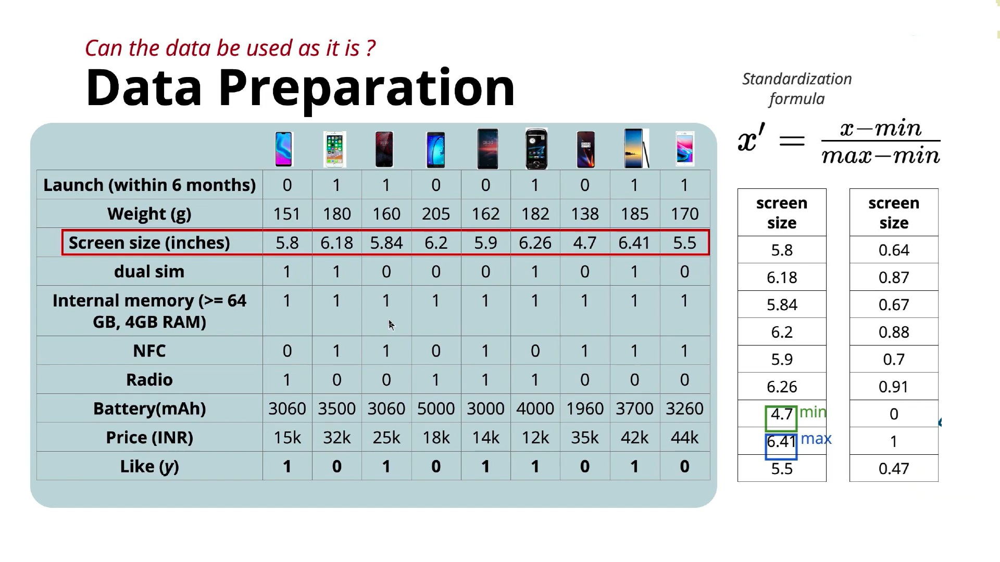

# Perceptron Model – Data & Task 

## 1. Difference Between MP Neuron and Perceptron

### MP Neuron

* Accepts only **Boolean (0/1) inputs**.
* Example:

  * Heavy → 1, Light → 0
  * Large screen → 1, Small screen → 0
* This loses a lot of useful information because real values are converted into only two categories.

### Perceptron

* Accepts **real-valued inputs**.

[
\mathbf{x} \in \mathbb{R}^n
]

where:

* (n) = number of features.
* Each feature can be any real number.
* Boolean values (0 and 1) are also allowed because they are real numbers.

Example features:

* Price = ₹32,000
* Screen Size = 6.2 inches
* Battery = 5000 mAh
* Weight = 190 g

This preserves much more information than MP Neuron.

---

# 2. Problem with Real-Valued Inputs

Different features have very different ranges.

Example:

| Feature     | Typical Range   |
| ----------- | --------------- |
| Price       | 15,000 – 50,000 |
| Screen Size | 5 – 7           |
| Battery     | 3000 – 6000     |
| Weight      | 150 – 250       |

If we directly feed these values into the model:

* Price values are extremely large.
* Screen size values are very small.
* Large-valued features may dominate the decision simply because of their scale, not because they are more important.

This makes learning difficult.

---

# 3. Solution: Standardization (Min-Max Scaling)

Before training the Perceptron, **every feature should be standardized**.

Formula:

[
x'=\frac{x-\min}{\max-\min}
]

where:

* (x) = original value
* min = minimum value of that feature
* max = maximum value of that feature
* (x') = standardized value

---

# 4. Why This Formula Works

### Minimum value

If

[
x=\min
]

then

[
x'=\frac{\min-\min}{\max-\min}=0
]

So,

**Minimum becomes 0.**

---

### Maximum value

If

[
x=\max
]

then

[
x'=\frac{\max-\min}{\max-\min}=1
]

So,

**Maximum becomes 1.**

---

### Every other value

Any value between min and max automatically becomes a number between **0 and 1**.

Therefore,

After standardization:

[
0 \le x' \le 1
]

---

# 5. Example



* All other values lie between 0 and 1.

---

# 6. Relative Differences Are Preserved

Standardization changes only the **scale**, not the ordering or relative positions.

Example:

Original:

```
4.7 -------- 5.5 -------- 6.41
```

After scaling:

```
0 -------- 0.47 -------- 1
```

The distances are proportionally maintained, making the features comparable.

---

# 7. Standardize Every Feature Separately

The same Min-Max Scaling is applied independently to:

* Screen Size
* Battery
* Price
* Weight
* Any other feature

After scaling, every feature has values in the range **0 to 1**, preventing any single feature from dominating due to its magnitude.

---

# 8. Data in the Perceptron

### Input

* Real-valued features
* Standardized to the range **[0, 1]**

### Output

Still **Boolean**:

* 0 → No
* 1 → Yes

The Perceptron is still used for **binary classification**.

Examples:

* Like / Not Like
* Buy / Don't Buy
* Spam / Not Spam
* Accept / Reject

---

# 9. Task Supported by Perceptron

The Perceptron performs **Binary Classification**, where the model predicts one of two possible classes based on the standardized real-valued inputs.

---

# Key Takeaways

* **MP Neuron** accepts only **Boolean inputs (0/1)**.
* **Perceptron** accepts **real-valued inputs ((\mathbb{R}^n))**.
* Real-valued features often have different ranges, which can bias the model.
* To avoid this, apply **Min-Max Standardization**:
  [
  x'=\frac{x-\min}{\max-\min}
  ]
* After standardization:

  * Minimum → 0
  * Maximum → 1
  * All values lie between **0 and 1**
  * Relative ordering and distances are preserved.
* The **input becomes standardized real-valued data**, while the **output remains Boolean**, making the Perceptron suitable for **binary classification tasks**.
