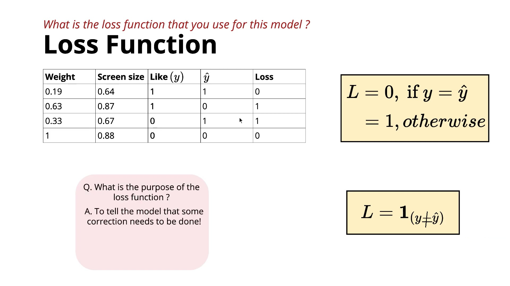
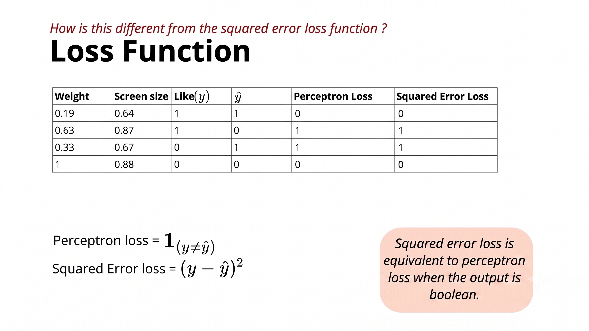

# Perceptron – Loss Function (Lecture Summary)

---

# 1. Recap

So far, we have learned the first three components of a machine learning model:

* **Data**

  * Real-valued inputs (after standardization)
* **Task**

  * Binary Classification (0 or 1)
* **Model**

  * Perceptron learns a line/plane (hyperplane) to separate the two classes.

Now, the fourth component is the **Loss Function**.

---

# 2. What is a Loss Function?

A **loss function** measures how well or poorly the model is performing.

* If the prediction is **correct**, the loss should be small (or zero).
* If the prediction is **wrong**, the loss should be larger.

The goal during training is to **minimize the total loss**.

---

# 3. Perceptron Loss Function

---

# 4. Purpose of the Loss Function

The loss function tells us **whether the model is making mistakes**.

If the loss is high, it means the decision boundary (line/plane) is not correctly separating the classes.

The model then adjusts its parameters:

* Weights ($w_1, w_2, \dots, w_n$)
* Threshold/Bias ($b$)

to reduce the loss and improve classification.

This parameter adjustment is done by the **learning algorithm**, which is covered later.

---

# 5. Decision Boundary Reminder

The Perceptron learns a decision boundary:

$$w_1x_1 + w_2x_2 + \cdots + w_nx_n - b = 0$$

If some positive and negative points are on the wrong side of this boundary, the loss becomes non-zero.

The objective is to move or rotate the boundary until it correctly separates the classes (if the data is linearly separable).

---

# 6. Comparison with Squared Error Loss

The Squared Error Loss is:

$$L = (y - \hat{y})^2$$

Since $y$ and $\hat{y}$ are **Boolean values (0 or 1)**:

### Case 1: Correct Prediction

If:

$$y = \hat{y}$$

then:

$$y - \hat{y} = 0$$

and:

$$(0)^2 = 0$$

$$\text{Loss} = 0$$

---

### Case 2: Wrong Prediction

If:

$$y \ne \hat{y}$$

then:

$$|y - \hat{y}| = 1$$

and:

$$(1)^2 = 1$$

$$\text{Loss} = 1$$
---

# 7. Why Are They Equivalent Here?

For Boolean outputs:

| (y) | (\hat y) | 0–1 Loss | Squared Error |
| --: | -------: | -------: | ------------: |
|   0 |        0 |        0 |             0 |
|   0 |        1 |        1 |             1 |
|   1 |        0 |        1 |             1 |
|   1 |        1 |        0 |             0 |

Thus, when the output is binary:

[
\boxed{\text{Perceptron Loss} = \text{Squared Error Loss}}
]

Historically, the Perceptron was defined using the 0–1 loss, but for this course, you can think of it as being equivalent to squared error loss in this binary setting.

---

# Key Takeaways

* The **loss function** measures the model's prediction error.
* The Perceptron uses the **0–1 loss**:
  [
  L=
  \begin{cases}
  0,& y=\hat y\
  1,& y\ne\hat y
  \end{cases}
  ]
* The **indicator function** (\mathbf{1}_{(y\ne\hat y)}) is a compact notation for this loss.
* The loss signals whether the decision boundary needs to be adjusted.
* For **binary outputs (0/1)**, the Perceptron loss and the **squared error loss** produce identical values:

  * Correct prediction → Loss = 0
  * Incorrect prediction → Loss = 1
* Therefore, in this context, you can treat the **Perceptron loss** and **squared error loss** as equivalent.
