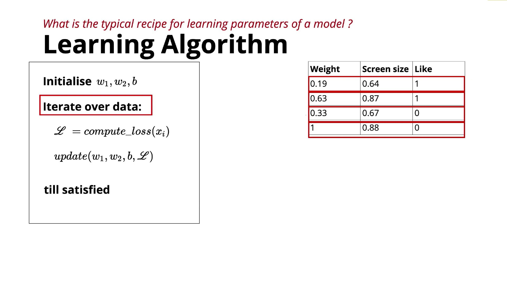

# Perceptron – General Learning Algorithm 

* The **learning algorithm** is responsible for finding the best values of the **weights** and **bias**.
* Training begins with **random initialization** of all parameters.
* For each training example:

  1. Make a prediction.
  2. Compute the loss.
  3. Update the parameters.
* This process is repeated over the entire dataset multiple times.
* Training stops when either:

  * The loss becomes **0** (ideal), or
  * The loss becomes **smaller than a predefined threshold** (\varepsilon) (practical).
* The exact rule for updating the weights is specific to the chosen learning algorithm, which will be introduced next.

