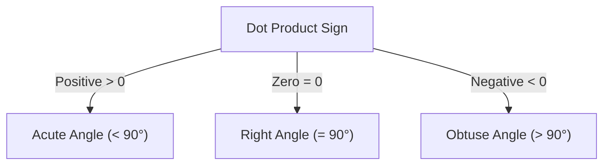
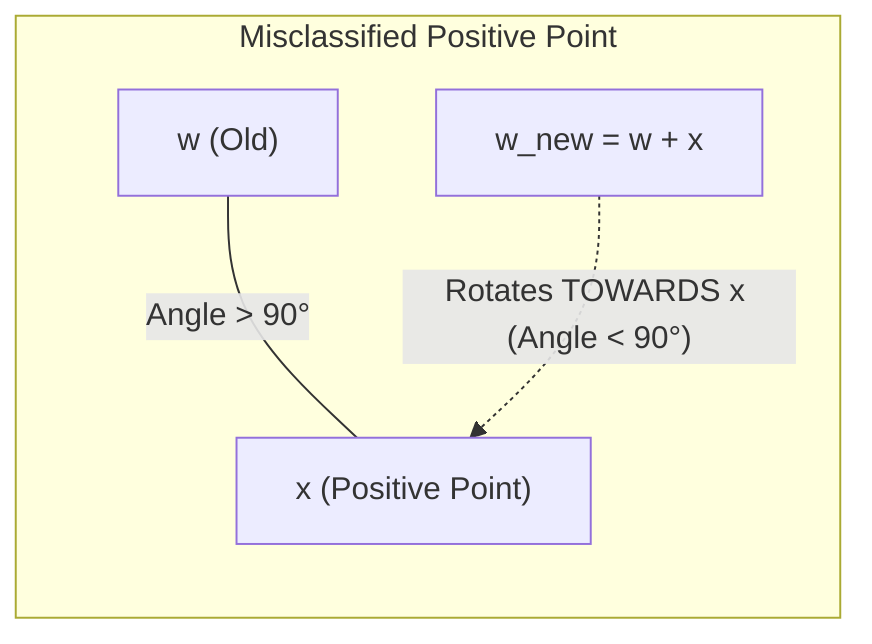
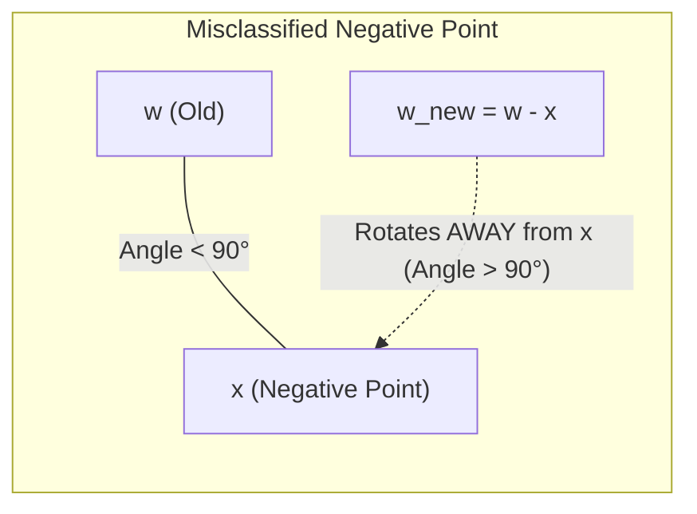
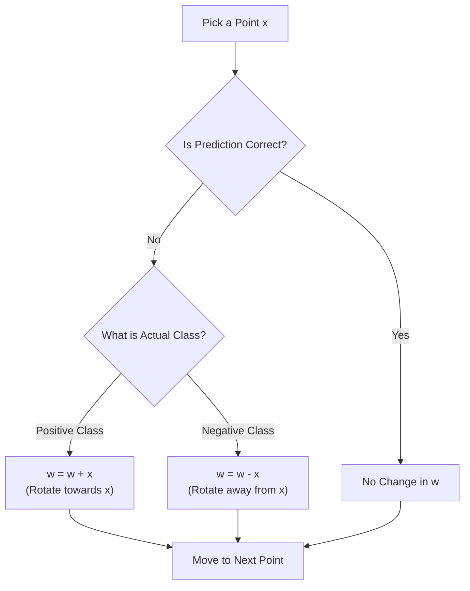

Bhai, bilkul! Images add karne ke liye **Mermaid diagrams** sabse badhiya aur clean tareeka hain, kyunki ye Markdown ke andar hi interactive diagrams render kar dete hain.

Maine aapke notes ko visual diagrams ke sath update kar diya hai taaki weight vector ($\mathbf{w}$) ka rotation aur angle movement clearly samajh aa jaye:

---

# Perceptron Learning Algorithm – Intuition Behind the Update Rule

This lecture explains **why the Perceptron update rules work geometrically**, not just how to apply them.

---

# 1. Goal of the Learning Algorithm

The Perceptron wants to learn the weight vector:

$$\mathbf{w} = [w_1, w_2, \dots, w_n]$$

so that every training point is classified correctly.

The bias ($b$) is ignored in this lecture to simplify the explanation.

---

# 2. Two Important Vectors

We have:

* **Weight Vector:** $\mathbf{w} = [w_1, w_2, \dots, w_n]$
* **Input Vector:** $\mathbf{x} = [x_1, x_2, \dots, x_n]$

The prediction depends on their **dot product**.

---

# 3. Dot Product and Angle

From Linear Algebra:

$$\cos\theta = \frac{\mathbf{w} \cdot \mathbf{x}}{\Vert{}\mathbf{w}\Vert{} \Vert{}\mathbf{x}\Vert{}}$$

where $\theta$ is the angle between $\mathbf{w}$ and $\mathbf{x}$.

Since $\Vert{}\mathbf{w}\Vert{} > 0$ and $\Vert{}\mathbf{x}\Vert{} > 0$, the denominator is **always positive**.

> **The sign of the dot product depends only on the numerator ($\mathbf{w} \cdot \mathbf{x}$).**

---

# 4. Relation Between Dot Product and Angle

| Dot Product | $\cos\theta$ | Angle |
| --- | --- | --- |
| $>0$ | Positive | Acute ($<90^\circ$) |
| $=0$ | Zero | $90^\circ$ |
| $<0$ | Negative | Obtuse ($>90^\circ$) |

---

# 5. Positive Training Point & Update Rule

Suppose the current point belongs to the **positive class** ($y = +1$).

* **Goal:** $\mathbf{w} \cdot \mathbf{x} \ge 0$ (Angle $< 90^\circ$)
* **Misclassification:** If $\mathbf{w} \cdot \mathbf{x} < 0$, the angle is $> 90^\circ$. We need to **reduce the angle**.

### Update Rule:

$$\boxed{\mathbf{w}_{\text{new}} = \mathbf{w} + \mathbf{x}}$$

Taking dot product with $\mathbf{x}$:

$$(\mathbf{w} + \mathbf{x})^T \mathbf{x} = \mathbf{w}^T \mathbf{x} + \mathbf{x}^T \mathbf{x}$$

Since $\mathbf{x}^T \mathbf{x} > 0$, cosine increases, angle decreases, and $\mathbf{w}$ rotates **towards** the positive example.

---

# 6. Negative Training Point & Update Rule

Suppose the point belongs to the **negative class** ($y = -1$).

* **Goal:** $\mathbf{w} \cdot \mathbf{x} < 0$ (Angle $> 90^\circ$)
* **Misclassification:** If $\mathbf{w} \cdot \mathbf{x} \ge 0$, the angle is $< 90^\circ$. We need to **increase the angle**.

### Update Rule:

$$\boxed{\mathbf{w}_{\text{new}} = \mathbf{w} - \mathbf{x}}$$

Taking dot product with $\mathbf{x}$:

$$(\mathbf{w} - \mathbf{x})^T \mathbf{x} = \mathbf{w}^T \mathbf{x} - \mathbf{x}^T \mathbf{x}$$

Since $\mathbf{x}^T \mathbf{x} > 0$, cosine decreases, angle increases, and $\mathbf{w}$ rotates **away from** the negative point.

---

# 7. Summary Flowchart

---

# Key Takeaways

* **Positive Misclassified:** $\mathbf{w}_{\text{new}} = \mathbf{w} + \mathbf{x} \implies$ Angle kam karo (Move **towards** $x$).
* **Negative Misclassified:** $\mathbf{w}_{\text{new}} = \mathbf{w} - \mathbf{x} \implies$ Angle badhao (Move **away** from $x$).