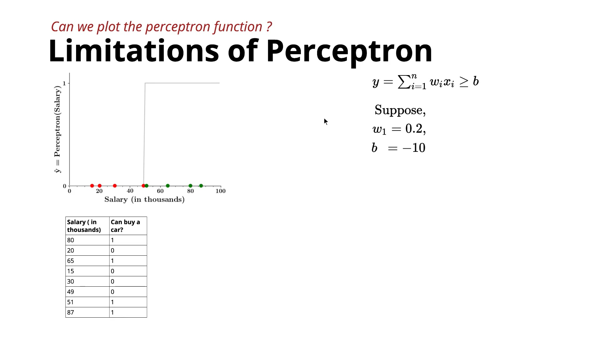
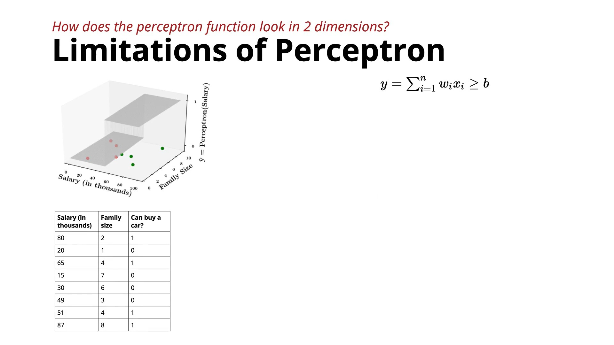

# **Limitations of Perceptron & Motivation for Sigmoid Neuron**

This lecture revisits the **limitations of the Perceptron** and explains **why the Sigmoid Neuron is needed**. 

## 1. Perceptron Output is a Step Function




* In a **1D input**, the perceptron outputs:

  * **0** on one side of the threshold.
  * **1** on the other side.
* This creates a **step function** with a sudden jump from 0 to 1.
* In **2D**, the output becomes a **2D step function**, where one region is entirely 0 and the other is entirely 1. 

---

### 2. Perceptron Can Only Create Linear Decision Boundaries

* In:

  * **1D** → it creates a threshold (split point).
  * **2D** → it creates a line.
  * **3D** → it creates a plane.
* By changing weights and bias, the line/plane can move or rotate, but it **always remains linear**.
* Therefore, it **cannot classify non-linearly separable data**. 

---

### 3. The Decision Boundary is Too Harsh

Example:

* Salary = **₹50.1K** → Predicts **Buy Car (1)**.
* Salary = **₹49.9K** → Predicts **Don't Buy Car (0)**.

Although the salaries differ by only ₹200, the prediction changes completely.

In reality:

* A person earning around ₹50K should have **some probability** (e.g., 50%) of buying a car instead of a strict yes/no answer.

Thus, the perceptron makes **very sharp and unrealistic decisions**. 

---

## Why Do We Need a Sigmoid Neuron?

The Sigmoid Neuron solves this by producing **smooth outputs** instead of abrupt 0 or 1 values.

Instead of:

```
0 -----------> 1
       |
     sudden jump
```

It produces something like:

```
0
 \
  \
   \
    \
     \
      1
```

This means the output can be:

* 0.1
* 0.3
* 0.5
* 0.8
* 0.95

These values can be interpreted as **probabilities**, making predictions much more realistic. 

---

## Changes from Perceptron to Sigmoid Neuron

| Feature           | Perceptron           | Sigmoid Neuron                             |
| ----------------- | -------------------- | ------------------------------------------ |
| Input             | Real-valued          | Real-valued                                |
| Output            | Only 0 or 1          | Any real value (typically between 0 and 1) |
| Tasks             | Classification only  | Classification + Regression                |
| Decision Boundary | Sharp                | Smooth                                     |
| Function          | Linear step function | Non-linear sigmoid function                |
| Loss Function     | Squared Error        | Squared Error                              |
| Evaluation        | Accuracy             | Accuracy + RMSE                            |


---

## Important Note

Although the **Sigmoid Neuron introduces non-linearity**, **a single sigmoid neuron still cannot fully solve non-linearly separable problems**. To handle such problems effectively, we need **multiple sigmoid neurons connected together**, forming a **Deep Neural Network**. 

---

## Key Takeaways

* Perceptron outputs only **0 or 1**, creating a **step function**.
* It can learn **only linear decision boundaries**.
* Its predictions are **too abrupt** for many real-world problems.
* **Sigmoid Neuron** provides **smooth probability-like outputs**, supports **regression and classification**, and serves as the **fundamental building block of deep neural networks**. 
