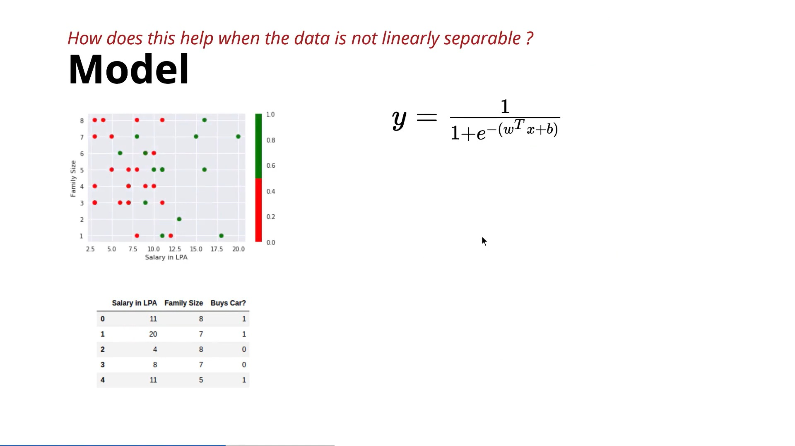
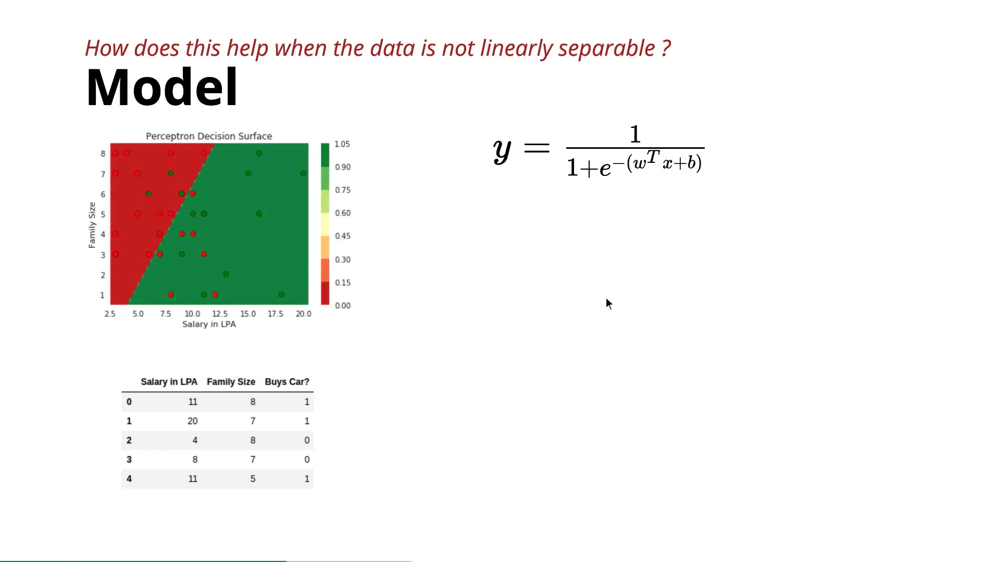
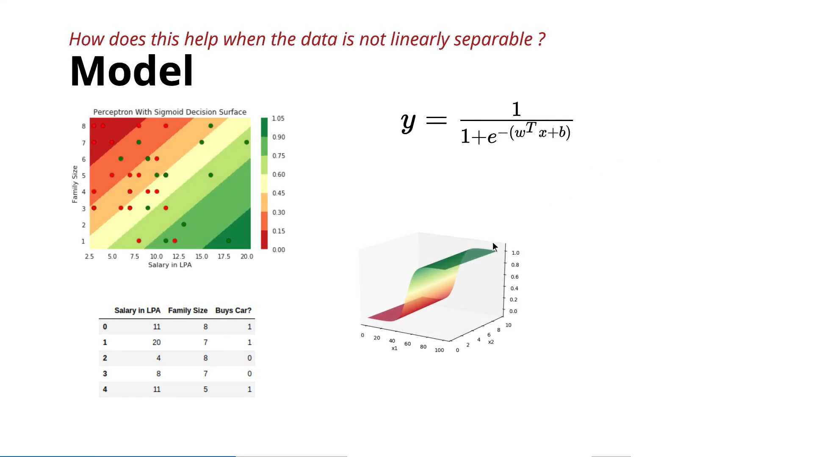

# **What Does a Sigmoid Neuron Actually Improve?**

In this lecture, the instructor explains **what the sigmoid neuron can and cannot do** compared to the perceptron. The main takeaway is that **a single sigmoid neuron still cannot solve non-linearly separable problems**, but it provides **probability-like outputs** instead of hard 0/1 decisions.

---

## 1. Problem Setup

The model uses two input features:

* **$x_1$: Salary (lakhs per annum)**
* **$x_2$: Family Size**

The task is to predict whether a person will **buy a car**.

The sigmoid model assumes:

$$\hat{y} = \frac{1}{1 + e^{-(w_1x_1 + w_2x_2 + b)}}$$

where $w_1$, $w_2$, and $b$ are the parameters to be learned.

---

## 2. Does the Sigmoid Solve Non-Linearly Separable Data?

At first glance, the sigmoid function is **non-linear (S-shaped)**.

So the natural question is:

> **Can a single sigmoid neuron classify non-linearly separable data?**

### Answer:

**No.**

Even though the sigmoid function itself is non-linear, **a single sigmoid neuron still cannot separate non-linearly separable data**.

It still produces only one smooth decision boundary, so complex patterns remain unsolved.

This is why **multiple sigmoid neurons** are later combined to form **deep neural networks**.

---

## 3. Limitation of the Perceptron

Consider two negative examples:

* One point is **far from the decision boundary**.
* Another point is **very close to the boundary**.

The perceptron predicts:

* Both $\rightarrow$ **0**

It makes **no distinction** between:

* A point it is extremely confident about.
* A point it is uncertain about.

Every point on the same side of the boundary receives the same prediction.

---

## 4. Advantage of the Sigmoid Neuron

The sigmoid produces **continuous outputs between 0 and 1** instead of only 0 or 1.

Examples:

| Region | Sigmoid Output | Interpretation |
| :--- | :--- | :--- |
| Deep red | $\approx 0$ | Almost impossible |
| Near boundary | $0.3$ | $30\%$ chance |
| Slightly positive | $0.7$ | $70\%$ chance |
| Deep green | $0.9 - 1.0$ | Almost certain |

Instead of saying:

> "Will buy" or "Won't buy"

the sigmoid says:

> "There is a **30%**, **70%**, or **90% probability** of buying."

This provides much richer information.

---

## 5. Output as Probability

Since the sigmoid output always lies between **0 and 1**, it can be interpreted as a **probability**.

For example:

* Output = **0** $\rightarrow$ 0% chance
* Output = **0.3** $\rightarrow$ 30% chance
* Output = **0.5** $\rightarrow$ 50% chance
* Output = **0.7** $\rightarrow$ 70% chance
* Output = **1** $\rightarrow$ Nearly 100% chance

This is the biggest improvement over the perceptron.

---

## 6. Effect of Changing Weights and Bias

Changing:

* $w_1$
* $w_2$
* $b$

changes the **position and orientation** of the sigmoid surface.

Different parameter values produce different probability regions.

However:

* The probabilities change.
* The smooth boundary moves.
* **But a single sigmoid neuron still cannot perfectly separate non-linearly separable data.**

---

## 7. Learning the Parameters

At this stage, the instructor has **not yet explained**:

* How to learn $w$ and $b$.
* Which parameter values are best.
* How to compare two different sigmoid models.

To answer these questions, the course will later introduce:

* **Loss Function**
* **Learning Algorithm (Optimization)**

These will determine the best values of the parameters.

---

# Perceptron vs Sigmoid

| Feature | Perceptron | Sigmoid Neuron |
| :--- | :--- | :--- |
| Output | 0 or 1 | Any value between 0 and 1 |
| Interpretation | Hard decision | Probability |
| Confidence | No | Yes |
| Decision Boundary | Sharp | Smooth |
| Solves Non-linear Data? | ❌ No | ❌ No (single neuron) |

---

# Key Takeaways

* A **single sigmoid neuron does not solve non-linearly separable problems**.
* Its major improvement over the perceptron is **smooth, probability-like outputs**.
* The output can be interpreted as the **confidence** that an input belongs to the positive class.
* Changing the weights and bias changes the probability surface, but finding the **best** parameters requires a **loss function** and a **learning algorithm**, which will be introduced next.