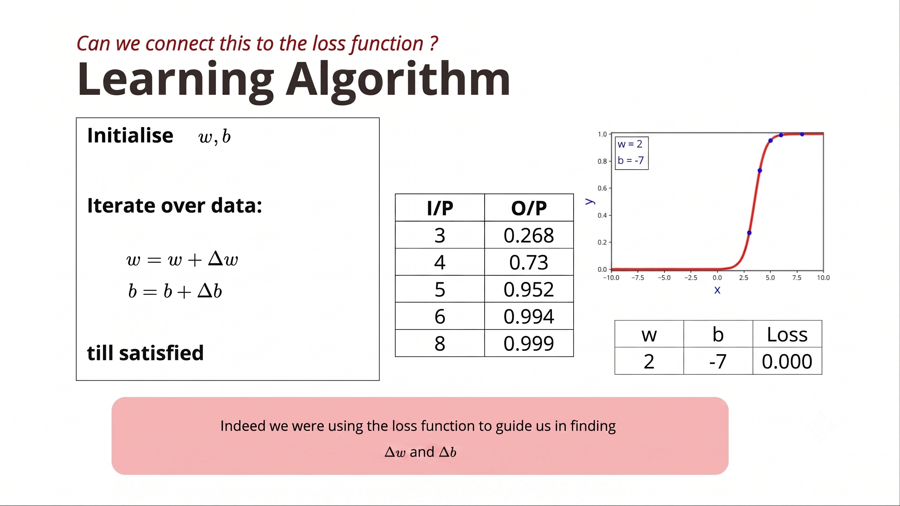

# **Connecting the Learning Algorithm with the Loss Function**

In this lecture, the instructor explains how the learning algorithm should be guided by the loss function. He analyzes the earlier guesswork algorithm and shows why it is inefficient, motivating the need for a systematic optimization method.

---

## 1. Recap: Goal of Learning

The objective is to find the best values of:

* Weight ($w$)
* Bias ($b$)

such that the sigmoid function predicts outputs very close to the true outputs.

This is equivalent to:

$$\boxed{\text{Minimize the Loss Function}}$$

---

## 2. Computing Loss for Different Parameters

Initially:

$$w = 0, \qquad b = 0$$

The sigmoid predicts:

$$\hat{y} = 0.5$$

for every input.

Using the Squared Error Loss:

$$\boxed{\text{Loss} = \frac{1}{n} \sum_{i=1}^{n} (y_i - \hat{y}_i)^2}$$

the average loss is approximately:

$$\boxed{0.1609}$$

This high loss indicates that the current sigmoid is a poor fit.

---

## 3. Effect of Guesswork



The instructor manually changes the parameters and observes the loss.

**Example progression:**

| Parameters | Loss |
| --- | --- |
| $(w = 0, b = 0)$ | $0.1609$ |
| $(w = 1, b = 0)$ | $0.1064$ (improved) |
| $(w = 2, b = 0)$ | Increased (worse) |
| $(w = 3, b = 0)$ | Increased further |
| Adjust $b$ | Loss decreases |
| Wrong adjustment | Loss increases again |
| Final parameters | Loss $\approx 0$ |

> **Observation:**
> Guesswork sometimes decreases the loss ✅ and sometimes increases the loss ❌. The updates are inconsistent and inefficient.

---

## 4. Why Guesswork is Bad

The parameter updates are random. As a result:

* Sometimes they move toward the solution.
* Sometimes they move away from it.
* Sometimes they overshoot the optimum.

This causes the loss to fluctuate (going down, up, down, up, and finally down) instead of steadily decreasing, which is highly undesirable.

---

## 5. What We Actually Want

A good learning algorithm should ensure that:

* Every update improves the model.
* The loss decreases after each step.
* The parameters move consistently toward the best solution.

In other words:

$$\boxed{\text{Loss}_{t+1} < \text{Loss}_t}$$

at every iteration (ideally).

---

## 6. The Error (Loss) Surface

The instructor introduces an important visualization called the **Loss Surface** (or **Error Surface**).

* **X-axis:** Weight ($w$)
* **Y-axis:** Bias ($b$)
* **Z-axis:** Loss

Every point $(w, b)$ corresponds to:

1. Computing predictions using those parameters.
2. Calculating the squared error loss.
3. Plotting that loss as a height.

This forms a **3D surface**.

---

## 7. Meaning of the Loss Surface

For example, choose:

$$w = 2, \qquad b = -8$$

Then:

1. Compute predictions for every training sample.
2. Calculate the squared error.
3. Average the errors.
4. Plot that value on the surface.

Repeating this for all combinations of $w$ and $b$ creates the complete loss landscape.

---

## 8. Guesswork on the Loss Surface

The guesswork algorithm corresponds to random movements on the loss surface. Instead of moving directly downhill, it may:

* Go downhill.
* Climb uphill again.
* Move sideways.
* Overshoot the minimum.

So its trajectory is irregular.

---

## 9. Desired Learning Path

The ideal learning algorithm should:

1. Start from any random point on the loss surface.
2. Move only in directions that reduce the loss.
3. Continue descending until reaching the lowest point (minimum loss).

```text
Random Start
      ●
     /
    /
   /
  /
 ● ────────────► Lowest Loss

```

Unlike guesswork, the path should consistently move downhill.

---

## 10. Motivation for the Next Topic

This lecture sets up the need for a principled optimization algorithm.

Instead of guessing updates, we need an algorithm that:

* Looks at the current loss.
* Determines the correct direction to move.
* Updates $w$ and $b$ intelligently.
* Reaches the minimum loss efficiently.

The instructor will develop this algorithm in the upcoming lectures (leading toward **Gradient Descent**).

---

## Guesswork vs. Ideal Learning

| Guesswork | Ideal Learning |
| --- | --- |
| Random parameter updates | Systematic updates |
| Loss may increase | Loss should consistently decrease |
| Can overshoot the solution | Moves steadily toward the minimum |
| Inefficient | Efficient optimization |
| Based on intuition | Guided by the loss function |

---

## Key Takeaways

* The loss function measures how well the current values of $w$ and $b$ fit the training data.
* The earlier guesswork algorithm was indirectly trying to reduce the loss, but because the updates were random, the loss sometimes increased instead of decreasing.
* By plotting the loss for every possible pair of $w$ and $b$, we obtain a **loss (error) surface**, where the lowest point represents the best model parameters.
* An effective learning algorithm should move downhill on the loss surface, reducing the loss at every step until it reaches the minimum. This motivates the development of optimization methods such as **Gradient Descent** in the next lectures.

---

