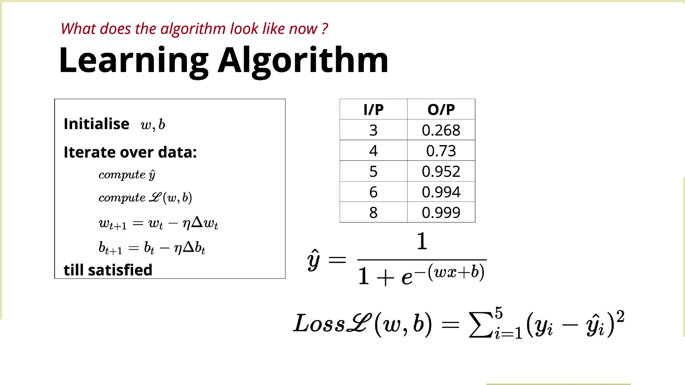

# **Learning Algorithm – "What to Do" vs "Why It Works"**

This lecture introduces a non-linear learning path in the course, allowing students to choose how deeply they want to understand the mathematics behind learning algorithms.

---

## 1. Two Learning Paths

The instructor explains that there are two ways to continue:

### Path 1 (Practical)

* Learn **what to do**.
* Use existing functions (like in PyTorch or TensorFlow).
* Build ML/DL models without understanding all the mathematics.
* Enough for coding, projects, competitions, and industry work.

### Path 2 (Mathematical)

* Learn **why the algorithm works**.
* Understand the mathematical derivation behind parameter updates.
* Optional for students interested in the theory.

---

## 2. Practical Learning Process

The training process remains the same:

1. Input data ($x, y$)
2. Use the sigmoid model to compute predictions ($\hat{y}$).
3. Calculate the loss using squared error:

$$\text{Loss} = \frac{1}{N}\sum (y - \hat{y})^2$$

4. Based on the loss, determine how to update $w$ and $b$.
5. Repeat until the model learns.

---

## 3. Frameworks Handle the Mathematics

Instead of manually calculating parameter updates:

* PyTorch
* TensorFlow

already provide functions that automatically compute the required updates.

You simply:

1. Define the model,
2. Define the loss,
3. Call the optimizer.

The framework figures out how to change the weights.

---

## 4. Training Loop

The overall training algorithm is:



```text
Initialize w and b

Repeat:
    Compute predictions (ŷ)
    Compute loss
    Compute parameter updates
    Update w and b

Until satisfied

```

This loop is repeated multiple times over the dataset.

---

## 5. When Do We Stop Training?

The instructor mentions three common stopping conditions:

### (a) Loss becomes zero

The model perfectly fits the training data.

### (b) Loss becomes very small

Example: $\text{Loss} = 0.002$. Further improvement is unnecessary.

### (c) Fixed number of iterations

Example: Train for $100$ epochs. Stop regardless of the final loss. This is the most common approach in practice.

---

## 6. The Mathematical Part (Optional)

Students who continue with the optional lectures will learn two important concepts.

* **First:** Why the update for the weight is based on:

$$\Delta w = -\frac{\partial L}{\partial w}$$

That is, the update comes from the derivative (gradient) of the loss with respect to the weight.

* **Second:** How to actually calculate this derivative mathematically.

These topics require calculus and are therefore optional.

---

## 7. `grad_w` in Code

When writing code, the instructor will use:

`grad_w`

This simply means: **Gradient (or derivative) of the loss with respect to the weight ($w$)**.

Mathematically:

$$\text{\texttt{grad\_w}} = \frac{\partial L}{\partial w}$$

Similarly, `grad_b` represents:

$$\text{\texttt{grad\_b}} = \frac{\partial L}{\partial b}$$

---

## 8. Main Takeaway

* You do not need to know calculus to build machine learning models.
* Modern libraries compute the gradients automatically.
* Understanding the mathematics gives deeper insight, but it is optional for becoming an effective ML practitioner.

---

## Summary Table

| Concept | Description |
| --- | --- |
| **Practical Path** | Focuses on implementation using libraries (PyTorch/TensorFlow) |
| **Theoretical Path** | Focuses on calculus derivatives and mathematical derivations |
| **`grad_w` / `grad_b**` | Code notation for $\frac{\partial L}{\partial w}$ and $\frac{\partial L}{\partial b}$ |
| **Stopping Rules** | Loss $= 0$, loss $\approx 0$, or fixed number of epochs |

---

## Key Takeaways

* The course splits into a practical path and an optional mathematical path.
* The training loop remains: **compute predictions $\rightarrow$ compute loss $\rightarrow$ compute gradients $\rightarrow$ update parameters $\rightarrow$ repeat**.
* Frameworks like PyTorch and TensorFlow automatically compute parameter updates under the hood.
* Training can stop when the loss becomes $0$, the loss becomes very small, or after a fixed number of iterations/epochs.
* In code, `grad_w` refers to the gradient (derivative) of the loss with respect to $w$, which is used to update the model parameters.

---
