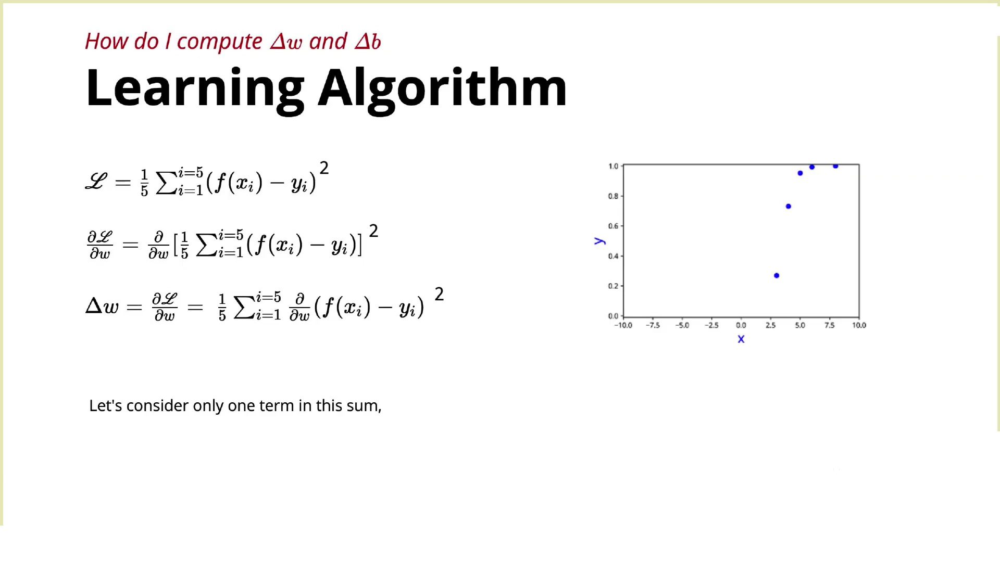
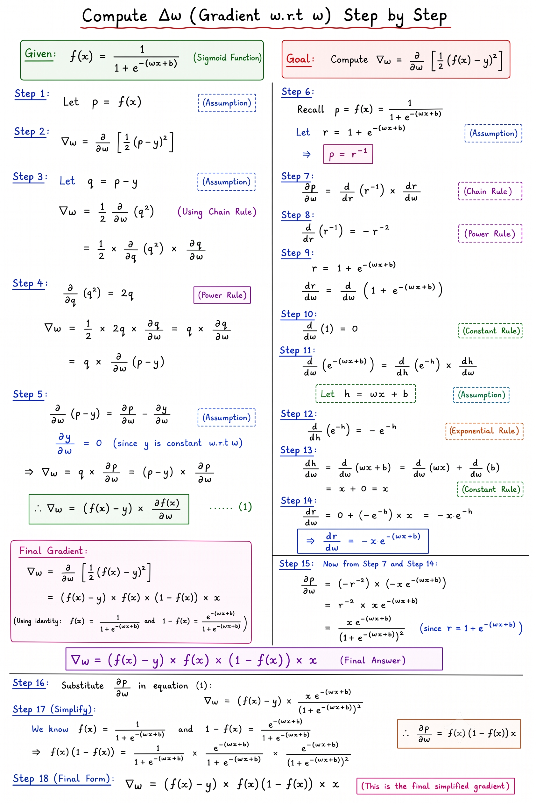

# **Computing the Gradient from Scratch (Gradient Descent)**

This lecture explains how to mathematically compute the gradients (partial derivatives) required for the Gradient Descent algorithm instead of relying on built-in functions like `compute_grad()`, PyTorch, or TensorFlow.

---

## 1. Goal of the Lecture

Previously, we learned the Gradient Descent update rules:

$$w \leftarrow w - \eta \frac{\partial L}{\partial w}$$

$$b \leftarrow b - \eta \frac{\partial L}{\partial b}$$

The remaining question was: **How do we actually calculate $\frac{\partial L}{\partial w}$ and $\frac{\partial L}{\partial b}$?**

This lecture derives those formulas step by step using calculus.

---

## 2. The Model

The sigmoid prediction for an input $x$ is:

$$f(x) = \hat{y} = \frac{1}{1 + e^{-(wx + b)}}$$

where:

* $w$ = weight
* $b$ = bias

---

## 3. Loss Function

The loss function used is Mean Squared Error (MSE):

$$L = \frac{1}{N} \sum_{i=1}^{N} (f(x_i) - y_i)^2$$

The instructor introduces a small mathematical modification:

$$\boxed{L = \frac{1}{2N} \sum_{i=1}^{N} (f(x_i) - y_i)^2}$$

### Why add the factor of $\frac{1}{2}$?

Because when applying the power rule during differentiation, $\frac{d}{dx}(x^2) = 2x$. The factor of $2$ cancels neatly with $\frac{1}{2}$, yielding a cleaner derivative without introducing unnecessary constant factors. This is a standard simplification trick in machine learning.

---

## 4. Differentiate One Training Example First

Instead of differentiating the full summation across all examples at once, we first calculate the derivative for a single data point:

$$L_i = \frac{1}{2} (f(x) - y)^2$$

After finding this single-example gradient, we sum the results across all data points and average over $N$.

---

## 5. Applying the Chain Rule

Let $z = f(x) - y$. The single-example loss becomes:

$$L_i = \frac{1}{2} z^2$$

Applying the chain rule:

$$\frac{\partial L_i}{\partial w} = \frac{\partial L_i}{\partial z} \cdot \frac{\partial z}{\partial w} = z \cdot \frac{\partial z}{\partial w}$$

Since $z = f(x) - y$ and the true label $y$ is a constant:

$$\frac{\partial z}{\partial w} = \frac{\partial f(x)}{\partial w}$$

Substituting this back gives:

$$\frac{\partial L_i}{\partial w} = (f(x) - y) \cdot \frac{\partial f(x)}{\partial w}$$

Now the remaining task is calculating the derivative of the sigmoid function $\frac{\partial f(x)}{\partial w}$.

---

## 6. Differentiating the Sigmoid Function

The sigmoid function is:

$$f(x) = \frac{1}{1 + e^{-(wx + b)}}$$

Applying the chain rule repeatedly across the outer power, exponential, and inner linear term $(-(wx + b))$ gives the derivative:

$$\boxed{\frac{\partial f(x)}{\partial w} = f(x)(1 - f(x))x}$$

This is one of the most fundamental formulas in neural networks and machine learning.

---

## 7. Final Gradient Formula for Weight ($w$)

Substituting the sigmoid derivative back into the single-example loss derivative yields:

$$\boxed{\frac{\partial L_i}{\partial w} = (f(x) - y) \cdot f(x)(1 - f(x)) \cdot x}$$

This gives the gradient component for a single training example.

---

## 8. Gradient for the Whole Dataset

Since differentiation is a linear operation, the derivative of a sum equals the sum of the individual derivatives. Averaging across $N$ training examples gives:

$$\boxed{\frac{\partial L}{\partial w} = \frac{1}{N} \sum_{i=1}^{N} (f(x_i) - y_i) \cdot f(x_i)(1 - f(x_i)) \cdot x_i}$$

This is the exact mathematical gradient formula used to update the weight $w$.

---

## 9. Gradient with Respect to Bias ($b$)

The derivation for bias follows the same chain rule steps.

The only difference occurs at the innermost layer:

$$\frac{\partial (wx + b)}{\partial b} = 1 \quad \text{instead of} \quad \frac{\partial (wx + b)}{\partial w} = x$$

Therefore, the gradient for the bias across the whole dataset is:

$$\boxed{\frac{\partial L}{\partial b} = \frac{1}{N} \sum_{i=1}^{N} (f(x_i) - y_i) \cdot f(x_i)(1 - f(x_i))}$$

*Notice that the input multiplier $x_i$ vanishes for the bias derivative.*

---

## 10. How This Translates to Code

For every iteration:

1. Compute prediction: $\hat{y} = f(x)$
2. Compute prediction error: $(\hat{y} - y)$
3. Compute sigmoid derivative term: $\hat{y}(1 - \hat{y})$
4. Multiply elements together:
   * **For Weight Gradient:** $(\hat{y} - y) \cdot \hat{y}(1 - \hat{y}) \cdot x$
   * **For Bias Gradient:** $(\hat{y} - y) \cdot \hat{y}(1 - \hat{y})$
5. Sum over all $N$ examples and divide by $N$.
6. Update parameters:

$$w \leftarrow w - \eta \frac{\partial L}{\partial w}$$

$$b \leftarrow b - \eta \frac{\partial L}{\partial b}$$

---

## Summary Table

| Parameter | Single-Example Gradient | Full Dataset Gradient Formula |
| :--- | :--- | :--- |
| **Weight ($w$)** | $(f(x) - y) f(x)(1 - f(x)) x$ | $\frac{\partial L}{\partial w} = \frac{1}{N} \sum_{i=1}^{N} (f(x_i) - y_i) f(x_i)(1 - f(x_i)) x_i$ |
| **Bias ($b$)** | $(f(x) - y) f(x)(1 - f(x))$ | $\frac{\partial L}{\partial b} = \frac{1}{N} \sum_{i=1}^{N} (f(x_i) - y_i) f(x_i)(1 - f(x_i))$ |

---

## Key Takeaways

* Gradients are derived from scratch using repeated applications of the chain rule.
* Scaling the loss function by $\frac{1}{2}$ simplifies calculations by canceling out the exponent factor during differentiation.
* The derivative of the sigmoid function $f(x)$ is $f(x)(1 - f(x))$.
* The final complete dataset gradients are:

$$\frac{\partial L}{\partial w} = \frac{1}{N} \sum_{i=1}^{N} (f(x_i) - y_i) f(x_i)(1 - f(x_i)) x_i$$

$$\frac{\partial L}{\partial b} = \frac{1}{N} \sum_{i=1}^{N} (f(x_i) - y_i) f(x_i)(1 - f(x_i))$$

* Modern frameworks like PyTorch and TensorFlow compute these exact expressions behind the scenes using automatic differentiation (*autograd*).