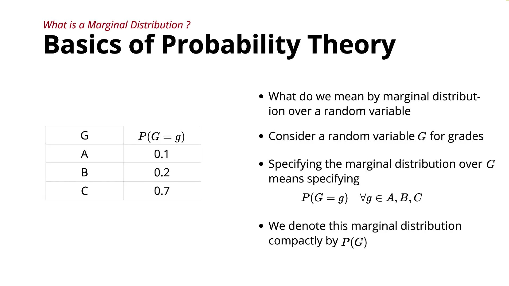

# Distribution and Marginal Distribution

This lecture introduces the concept of a **probability distribution**.

### 1. What is a distribution?

A distribution tells us:

> **What values can a random variable take, and what is the probability of each value?**

For example, suppose a random variable **Grade (G)** can take three values:

| Grade       |      A |      B |      C |
| ----------- | -----: | -----: | -----: |
| Probability | P(G=A) | P(G=B) | P(G=C) |

All probabilities must add up to:

[
P(G=A)+P(G=B)+P(G=C)=1
]

So, the **distribution of a random variable** is basically a table showing every possible value and its corresponding probability.

---

### 2. Connection with a sigmoid neuron

The lecture connects this idea to **binary classification using a sigmoid neuron**.

Suppose a sigmoid neuron outputs:

[
0.7
]

This means the model predicts:

[
P(Y=1)=0.7
]

and therefore:

[
P(Y=0)=0.3
]

So the model's **predicted distribution** is:

| Class                 |   0 |   1 |
| --------------------- | --: | --: |
| Predicted Probability | 0.3 | 0.7 |

---

### 3. What is the true distribution?

Suppose we know the image actually **contains text**.

Then the correct class is:

[
Y=1
]

Therefore, the true distribution is:

| Class            | 0 (No Text) | 1 (Text) |
| ---------------- | ----------: | -------: |
| True Probability |           0 |        1 |

All the probability mass is assigned to the correct class.

---

### 4. The main idea

Now we have two distributions:

* **True distribution:** `[0, 1]`
* **Predicted distribution:** `[0.3, 0.7]`

The next question is:

> **How do we measure the difference between the true distribution and the predicted distribution?**

This difference is important because it tells us **how wrong the neural network's prediction is**. The instructor says this will be covered in the next video—this idea eventually leads toward **loss functions**, such as **cross-entropy loss**.

### In one line:

> **A probability distribution assigns a probability to every possible value of a random variable, and in machine learning, training involves comparing the model's predicted distribution with the true distribution.**
